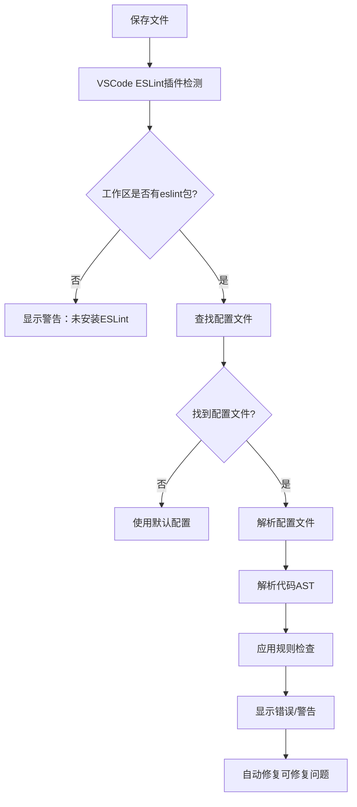

# ESLint + Prettier 配置指南

## 📋 目录
- [您描述的ESLint流程分析](#您描述的eslint流程分析)
- [ESLint工作原理详解](#eslint工作原理详解)
- [VSCode集成机制](#vscode集成机制)
- [完整配置流程](#完整配置流程)
- [最佳实践](#最佳实践)
- [常见问题解决](#常见问题解决)

## 您描述的ESLint流程分析

### ✅ 正确的部分

您描述的基本流程是**正确的**：

1. **ESLint的作用**：确实可以在编码阶段发现语法错误和代码质量问题
2. **VSCode插件机制**：ESLint插件会自动检测工作区是否安装了eslint包
3. **配置文件检测**：插件会读取`.eslintrc`等配置文件
4. **实时检查**：根据配置对代码进行实时审查
5. **Prettier集成**：用于保证代码风格一致性
6. **保存时格式化**：通过VSCode设置实现保存时自动校验

### ⚠️ 需要补充和完善的部分

1. **配置文件优先级**：您提到的`.eslintrc`文件，实际上ESLint支持多种配置文件格式
2. **ESLint与Prettier的冲突处理**：需要专门的配置来避免规则冲突
3. **Monorepo特殊配置**：您的项目是monorepo，需要考虑共享配置
4. **TypeScript支持**：需要额外的解析器和插件
5. **Git Hooks集成**：仅依赖编辑器检查是不够的

## ESLint工作原理详解

### 🔍 ESLint检测流程



### 📁 配置文件优先级（从高到低）

1. `.eslintrc.js`
2. `.eslintrc.cjs`
3. `.eslintrc.yaml` / `.eslintrc.yml`
4. `.eslintrc.json`
5. `package.json` 中的 `eslintConfig` 字段

### 🎯 ESLint插件检测机制

VSCode的ESLint插件会按以下顺序查找ESLint：

1. 当前工作区的 `node_modules/.bin/eslint`
2. 全局安装的ESLint
3. 插件内置的ESLint版本（fallback）

## VSCode集成机制

### 🔧 VSCode ESLint插件工作原理

```javascript
// VSCode ESLint插件的工作流程
{
  // 1. 文件保存时触发
  "editor.codeActionsOnSave": {
    "source.fixAll.eslint": true  // 自动修复ESLint问题
  },
  
  // 2. 实时检查配置
  "eslint.validate": [
    "javascript",
    "javascriptreact", 
    "typescript",
    "typescriptreact",
    "vue"
  ],
  
  // 3. 工作区检测
  "eslint.workingDirectories": ["./packages/*"],
  
  // 4. 与Prettier协作
  "editor.formatOnSave": true,
  "editor.defaultFormatter": "esbenp.prettier-vscode"
}
```

### 📝 VSCode设置文件位置

- **用户设置**：`~/Library/Application Support/Code/User/settings.json`
- **工作区设置**：`.vscode/settings.json`（推荐用于项目特定配置）

## 完整配置流程

### 第一步：安装依赖

```bash
# 在项目根目录执行
pnpm add -D -w eslint prettier

# TypeScript支持（必需）
pnpm add -D -w @typescript-eslint/eslint-plugin @typescript-eslint/parser

# ESLint与Prettier集成（必需）
pnpm add -D -w eslint-config-prettier eslint-plugin-prettier

# Vue支持（如果需要）
pnpm add -D -w eslint-plugin-vue

# React支持（如果需要）
pnpm add -D -w eslint-plugin-react eslint-plugin-react-hooks
```

**重要说明**：
- `@typescript-eslint/recommended` 配置来自 `@typescript-eslint/eslint-plugin` 包，不需要单独安装
- `prettier` 配置来自 `eslint-config-prettier` 包
- `plugin:prettier/recommended` 配置来自 `eslint-plugin-prettier` 包

### 第二步：创建ESLint配置

创建 `.eslintrc.js`：

```javascript
module.exports = {
  root: true,
  env: {
    browser: true,
    es2020: true,
    node: true,
  },
  extends: [
    'eslint:recommended',
    '@typescript-eslint/recommended',        // 来自 @typescript-eslint/eslint-plugin
    'plugin:prettier/recommended',          // 来自 eslint-plugin-prettier，必须放在最后
  ],
  parser: '@typescript-eslint/parser',
  parserOptions: {
    ecmaVersion: 2020,
    sourceType: 'module',
    ecmaFeatures: {
      jsx: true,
    },
  },
  plugins: ['@typescript-eslint', 'prettier'],
  rules: {
    'prettier/prettier': 'error',
    '@typescript-eslint/no-unused-vars': ['error', { argsIgnorePattern: '^_' }],
    '@typescript-eslint/no-explicit-any': 'warn',
  },
  ignorePatterns: [
    'dist',
    'node_modules',
    '.turbo',
    'coverage',
    '*.d.ts',
  ],
  overrides: [
    // Vue文件特殊配置
    {
      files: ['*.vue'],
      extends: ['plugin:vue/vue3-recommended'],
      parser: 'vue-eslint-parser',
      parserOptions: {
        parser: '@typescript-eslint/parser',
      },
    },
    // React文件特殊配置
    {
      files: ['*.jsx', '*.tsx'],
      extends: [
        'plugin:react/recommended',
        'plugin:react-hooks/recommended',
      ],
      settings: {
        react: {
          version: 'detect',
        },
      },
    },
  ],
};
```

### 第三步：创建Prettier配置

创建 `.prettierrc`：

```json
{
  "semi": true,
  "trailingComma": "es5",
  "singleQuote": true,
  "printWidth": 80,
  "tabWidth": 2,
  "useTabs": false,
  "endOfLine": "lf",
  "bracketSpacing": true,
  "bracketSameLine": false,
  "arrowParens": "avoid"
}
```

### 第四步：配置VSCode

创建 `.vscode/settings.json`：

```json
{
  "editor.formatOnSave": true,
  "editor.codeActionsOnSave": {
    "source.fixAll.eslint": true
  },
  "editor.defaultFormatter": "esbenp.prettier-vscode",
  "eslint.validate": [
    "javascript",
    "javascriptreact",
    "typescript",
    "typescriptreact",
    "vue"
  ],
  "eslint.workingDirectories": [
    "./packages/cli",
    "./packages/runtime", 
    "./packages/vite-plugin"
  ],
  "[typescript]": {
    "editor.defaultFormatter": "esbenp.prettier-vscode"
  },
  "[javascript]": {
    "editor.defaultFormatter": "esbenp.prettier-vscode"
  },
  "[vue]": {
    "editor.defaultFormatter": "esbenp.prettier-vscode"
  }
}
```

### 第五步：配置package.json脚本

```json
{
  "scripts": {
    "lint": "eslint . --ext .js,.jsx,.ts,.tsx,.vue",
    "lint:fix": "eslint . --ext .js,.jsx,.ts,.tsx,.vue --fix",
    "format": "prettier --write .",
    "format:check": "prettier --check ."
  }
}
```

### 第六步：配置Git Hooks（推荐）

安装husky和lint-staged：

```bash
pnpm add -D -w husky lint-staged
```

在package.json中添加：

```json
{
  "lint-staged": {
    "*.{js,jsx,ts,tsx,vue}": [
      "eslint --fix",
      "prettier --write"
    ],
    "*.{json,md,yml,yaml}": [
      "prettier --write"
    ]
  }
}
```

初始化husky：

```bash
npx husky install
npx husky add .husky/pre-commit "npx lint-staged"
```

## 最佳实践

### 🎯 Monorepo配置策略

对于您的项目，建议采用分层配置：

```
i18n/
├── .eslintrc.js              # 根配置
├── .prettierrc               # 全局Prettier配置
├── packages/
│   ├── cli/
│   │   └── .eslintrc.js      # CLI特定配置
│   ├── runtime/
│   │   └── .eslintrc.js      # Runtime特定配置
│   └── vite-plugin/
│       └── .eslintrc.js      # Plugin特定配置
└── .vscode/
    └── settings.json         # VSCode工作区配置
```

### 🚀 性能优化

1. **使用.eslintignore文件**：
```
node_modules/
dist/
.turbo/
coverage/
*.d.ts
```

2. **配置ESLint缓存**：
```json
{
  "scripts": {
    "lint": "eslint . --cache --cache-location .eslintcache"
  }
}
```

3. **Turbo集成**：
```json
{
  "pipeline": {
    "lint": {
      "inputs": ["src/**/*.{ts,tsx,js,jsx,vue}", ".eslintrc.js"],
      "outputs": [".eslintcache"]
    }
  }
}
```

### 🔒 严格模式配置

```javascript
// .eslintrc.js - 生产环境推荐配置
module.exports = {
  extends: [
    'eslint:recommended',
    '@typescript-eslint/recommended-requiring-type-checking',
    'plugin:prettier/recommended',
  ],
  parserOptions: {
    project: './tsconfig.json',
  },
  rules: {
    '@typescript-eslint/no-unused-vars': 'error',
    '@typescript-eslint/no-explicit-any': 'error',
    '@typescript-eslint/prefer-nullish-coalescing': 'error',
    '@typescript-eslint/prefer-optional-chain': 'error',
  },
};
```

## 常见问题解决

### ❌ 问题1：ESLint和Prettier规则冲突

**症状**：保存时代码被反复格式化
**解决**：确保安装了`eslint-config-prettier`并放在extends数组最后

```javascript
{
  "extends": [
    "eslint:recommended",
    "@typescript-eslint/recommended",
    "plugin:prettier/recommended" // 必须最后
  ]
}
```

### ❌ 问题2：VSCode不显示ESLint错误

**可能原因**：
1. 未安装ESLint插件
2. 工作区路径配置错误
3. ESLint配置文件语法错误

**解决步骤**：
1. 检查VSCode扩展是否安装
2. 查看输出面板的ESLint日志
3. 验证配置文件语法：`npx eslint --print-config .`

### ❌ 问题3：Monorepo中某些包不生效

**解决**：配置工作区目录

```json
{
  "eslint.workingDirectories": [
    "./packages/cli",
    "./packages/runtime",
    "./packages/vite-plugin"
  ]
}
```

### ❌ 问题4：TypeScript类型检查过慢

**解决**：使用项目引用

```javascript
// .eslintrc.js
{
  parserOptions: {
    project: ['./tsconfig.json', './packages/*/tsconfig.json'],
    tsconfigRootDir: __dirname,
  }
}
```

## 🎉 验证配置

配置完成后，执行以下命令验证：

```bash
# 检查ESLint配置
npx eslint --print-config src/index.ts

# 检查Prettier配置
npx prettier --check src/

# 运行完整检查
npm run lint
npm run format:check
```

## 📚 相关资源

- [ESLint官方文档](https://eslint.org/docs/)
- [Prettier官方文档](https://prettier.io/docs/)
- [VSCode ESLint插件](https://marketplace.visualstudio.com/items?itemName=dbaeumer.vscode-eslint)
- [TypeScript ESLint](https://typescript-eslint.io/)

---

**总结**：您描述的ESLint流程基本正确，但在实际项目中需要考虑更多细节，特别是ESLint与Prettier的集成、Monorepo的特殊配置，以及完整的开发工作流程。按照本指南配置后，您将拥有一个完整的代码质量保证体系。
