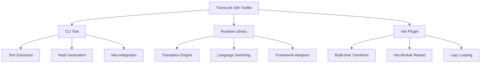
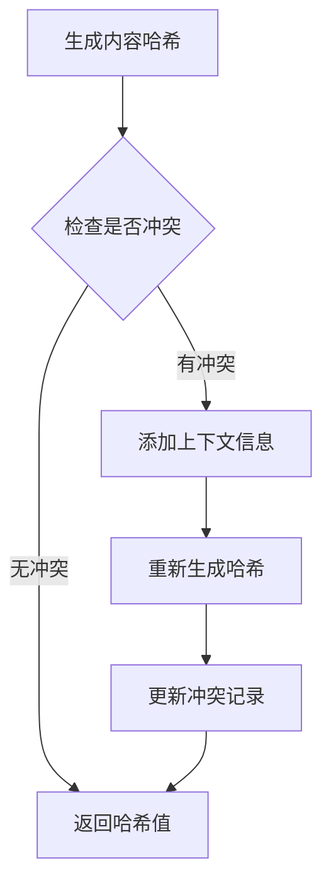
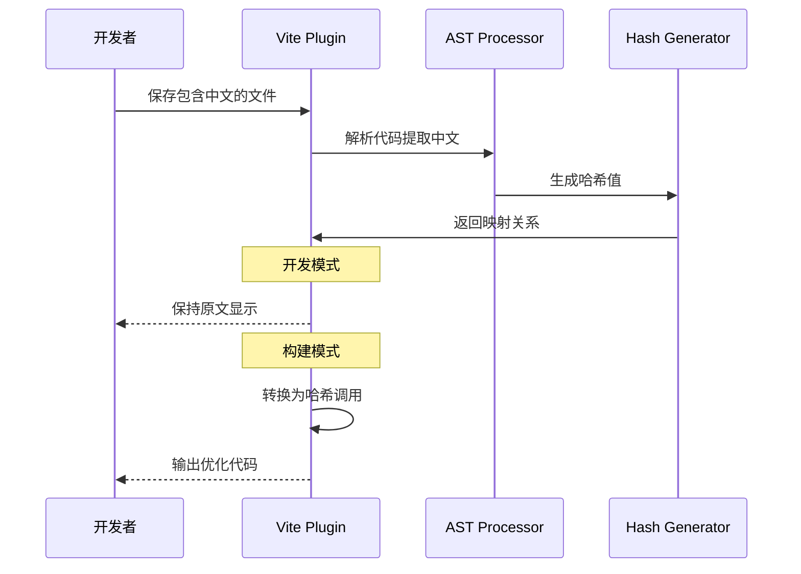
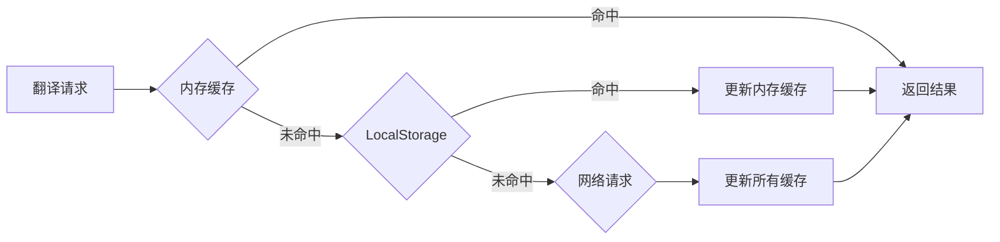
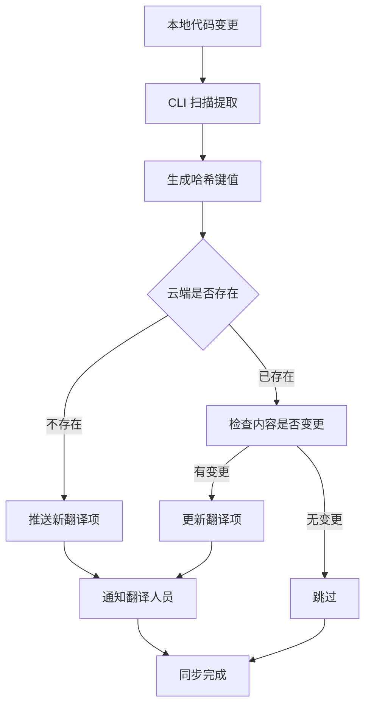
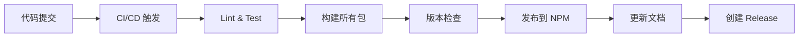

# Lynn I18n 工具集技术实施方案

## 🎯 项目概述

TransLink I18n 是一套现代化的国际化工具集，采用 monorepo 架构，提供从开发到部署的完整 i18n 解决方案。连接不同语言的智能桥梁，让国际化开发变得简单而优雅。

### 核心特性
- 🚀 **智能文本提取**: 基于 AST 的中文文本自动识别和哈希生成
- ☁️ **云端协作管理**: 集成维格表(Vika)的翻译协作平台
- ⚡ **开发体验优化**: 热更新、懒加载、构建时优化
- 🔧 **框架无关**: 支持 Vue3、React 等主流框架
- 📦 **现代工具链**: 基于 pnpm + Turborepo 的高效构建

## 🏗️ 项目架构



### 目录结构

```
translink-i18n/
├── packages/
│   ├── cli/                    # @translink/i18n-cli
│   │   ├── src/
│   │   │   ├── commands/       # 命令实现
│   │   │   ├── extractors/     # 文本提取器
│   │   │   ├── generators/     # 哈希生成器
│   │   │   └── integrations/   # 云端集成
│   │   └── package.json
│   ├── runtime/                # @translink/i18n-runtime
│   │   ├── src/
│   │   │   ├── core/           # 核心翻译引擎
│   │   │   ├── adapters/       # 框架适配器
│   │   │   └── cache/          # 缓存策略
│   │   └── package.json
│   └── vite-plugin/            # @translink/vite-plugin-i18n
│       ├── src/
│       │   ├── transform/      # 代码转换
│       │   ├── hmr/           # 热更新
│       │   └── loader/        # 语言包加载
│       └── package.json
├── apps/
│   ├── docs/                  # 文档站点
│   └── playground/            # 测试应用
├── tools/
│   └── eslint-config/         # 共享 ESLint 配置
├── turbo.json
├── pnpm-workspace.yaml
└── package.json
```

## 🔧 核心技术方案

### 1. 智能哈希生成策略

#### 混合智能哈希算法

```typescript
interface HashOptions {
  content: string;           // 文本内容
  filePath: string;         // 文件路径
  componentName?: string;   // 组件名
  functionName?: string;    // 函数名
}

function generateTranslationKey(options: HashOptions): string {
  // 1. 基础内容哈希
  const contentHash = sha256(options.content).substring(0, 8);
  
  // 2. 检查哈希冲突
  if (hasCollision(contentHash)) {
    // 3. 添加上下文信息
    const contextInfo = `${options.componentName || 'global'}_${options.functionName || 'default'}`;
    const contextHash = sha256(contextInfo).substring(0, 4);
    return `${contentHash}_${contextHash}`;
  }
  
  return contentHash;
}
```

#### 哈希碰撞处理流程



### 2. AST 处理与文本提取

#### 支持的模式识别

```typescript
// 静态文本
t('登录')
$tsl('用户名')

// 模板字符串
t(`欢迎 ${username}`)
$tsl(`共有 ${count} 条记录`)

// 条件表达式
t(isVip ? '尊贵会员' : '普通用户')

// 对象属性
t(messages.success)
```

#### GoGoCode 转换器实现

```typescript
import $ from 'gogocode';

class I18nExtractor {
  private patterns = [
    { func: 't', regex: /t\s*\(\s*['"`]([^'"`]+)['"`]\s*\)/ },
    { func: '$tsl', regex: /\$tsl\s*\(\s*['"`]([^'"`]+)['"`]\s*\)/ }
  ];

  extract(sourceCode: string, filePath: string): ExtractResult[] {
    const ast = $(sourceCode);
    const results: ExtractResult[] = [];

    // 查找所有翻译函数调用
    ast.find('CallExpression').each((node) => {
      const callee = node.attr('callee');
      if (this.isTranslationCall(callee)) {
        const textNode = node.attr('arguments.0');
        if (textNode && this.isChineseText(textNode.value)) {
          results.push({
            text: textNode.value,
            line: node.attr('loc.start.line'),
            column: node.attr('loc.start.column'),
            filePath
          });
        }
      }
    });

    return results;
  }
}
```

### 3. Vite 插件架构

#### 核心 Hooks 实现

```typescript
export function i18nPlugin(options: I18nPluginOptions): Plugin {
  let config: ResolvedConfig;
  let extractor: I18nExtractor;
  
  return {
    name: 'lynn-i18n',
    
    configResolved(resolvedConfig) {
      config = resolvedConfig;
      extractor = new I18nExtractor(options);
    },
    
    transform(code: string, id: string) {
      if (shouldTransform(id)) {
        // 开发模式：保持原文，添加映射
        if (config.command === 'serve') {
          return addDevMapping(code, id);
        }
        // 构建模式：转换为哈希
        return transformToHash(code, id);
      }
    },
    
    handleHotUpdate({ file, server }) {
      if (isLanguageFile(file)) {
        // 语言文件更新时刷新相关模块
        const affectedModules = getAffectedModules(file);
        affectedModules.forEach(mod => {
          server.moduleGraph.invalidateModule(mod);
        });
        server.ws.send({ type: 'full-reload' });
      }
    }
  };
}
```

#### 渐进式转换流程



### 4. 运行时库设计

#### 核心翻译引擎

```typescript
class I18nRuntime {
  private cache = new Map<string, string>();
  private currentLang = 'zh-CN';
  private resources = new Map<string, Record<string, string>>();
  
  async init(options: I18nOptions) {
    this.currentLang = options.defaultLang || 'zh-CN';
    await this.loadLanguage(this.currentLang);
  }
  
  t(key: string, params?: Record<string, any>): string {
    // 1. 缓存查找
    const cacheKey = `${this.currentLang}:${key}`;
    if (this.cache.has(cacheKey)) {
      return this.interpolate(this.cache.get(cacheKey)!, params);
    }
    
    // 2. 资源查找
    const langResource = this.resources.get(this.currentLang);
    const translation = langResource?.[key] || key;
    
    // 3. 缓存结果
    this.cache.set(cacheKey, translation);
    
    return this.interpolate(translation, params);
  }
  
  async switchLanguage(lang: string) {
    if (lang !== this.currentLang) {
      await this.loadLanguage(lang);
      this.currentLang = lang;
      this.cache.clear();
      this.emit('languageChanged', lang);
    }
  }
}
```

#### 多级缓存策略



### 5. 云端集成方案

#### Vika API 集成

```typescript
class VikaIntegration {
  private apiKey: string;
  private datasheetId: string;
  
  async pushTranslations(translations: TranslationItem[]) {
    const records = translations.map(item => ({
      fields: {
        key: item.key,
        'zh-CN': item.text,
        'en-US': '',
        status: 'pending',
        context: item.context,
        file: item.filePath
      }
    }));
    
    return this.vikaClient.records.create(this.datasheetId, records);
  }
  
  async pullTranslations(lang: string): Promise<Record<string, string>> {
    const response = await this.vikaClient.records.selectAll(this.datasheetId, {
      fields: ['key', lang],
      filterByFormula: `{${lang}} != ""`
    });
    
    return response.records.reduce((acc, record) => {
      acc[record.fields.key] = record.fields[lang];
      return acc;
    }, {} as Record<string, string>);
  }
}
```

#### 同步工作流



## 🛠️ 开发工具链

### CLI 命令设计

```bash
# 初始化配置
translink init

# 扫描并提取翻译
translink extract [--pattern="src/**/*.{vue,tsx,ts}"]

# 生成语言文件
translink build [--output="locales"]

# 推送到云端
translink push [--lang="zh-CN"]

# 从云端拉取
translink pull [--lang="en-US"]

# 分析翻译覆盖率
translink analyze [--report]
```

### 配置文件结构

```typescript
// i18n.config.ts
export default {
  // 扫描配置
  extract: {
    patterns: ['src/**/*.{vue,tsx,ts,jsx}'],
    exclude: ['node_modules/**', 'dist/**'],
    functions: ['t', '$tsl', 'i18n.t']
  },
  
  // 哈希配置
  hash: {
    algorithm: 'sha256',
    length: 8,
    includeContext: true
  },
  
  // 语言配置
  languages: {
    default: 'zh-CN',
    supported: ['zh-CN', 'en-US', 'ja-JP']
  },
  
  // 输出配置
  output: {
    directory: 'src/locales',
    format: 'json',
    splitByNamespace: false
  },
  
  // 云端配置
  vika: {
    apiKey: process.env.VIKA_API_KEY,
    datasheetId: process.env.VIKA_DATASHEET_ID,
    autoSync: true
  }
} satisfies I18nConfig;
```

## 📦 构建与发布

### Turborepo 配置

```json
{
  "$schema": "https://turborepo.org/schema.json",
  "pipeline": {
    "build": {
      "dependsOn": ["^build"],
      "outputs": ["dist/**", "lib/**"]
    },
    "test": {
      "dependsOn": ["build"],
      "outputs": ["coverage/**"]
    },
    "lint": {
      "outputs": []
    },
    "type-check": {
      "dependsOn": ["^build"],
      "outputs": []
    }
  }
}
```

### 发布策略



## 🎯 实施里程碑

### Phase 1: 基础架构 (Week 1-2)
- [x] 搭建 monorepo 基础结构
- [x] 配置 pnpm + Turborepo
- [x] 设置 TypeScript 和构建工具链
- [ ] 实现基础的 CLI 框架

### Phase 2: 核心功能 (Week 3-4)
- [ ] 实现 AST 文本提取器
- [ ] 开发哈希生成算法
- [ ] 构建运行时翻译引擎
- [ ] 集成 Vika API

### Phase 3: Vite 插件 (Week 5-6)
- [ ] 开发 Vite 插件核心功能
- [ ] 实现热更新机制
- [ ] 添加构建时优化
- [ ] 支持懒加载

### Phase 4: 框架集成 (Week 7-8)
- [ ] Vue3 适配器开发
- [ ] React 适配器开发
- [ ] 测试用例编写
- [ ] 性能优化

### Phase 5: 文档与发布 (Week 9-10)
- [ ] 完善 API 文档
- [ ] 编写使用指南
- [ ] 发布到 NPM
- [ ] 社区推广

## 🔍 质量保证

### 测试策略
- **单元测试**: 每个核心模块 >90% 覆盖率
- **集成测试**: CLI 命令和 API 集成测试  
- **E2E 测试**: 完整工作流测试
- **性能测试**: 大型项目扫描性能测试

### 代码质量
- **ESLint**: 统一代码风格
- **Prettier**: 自动格式化
- **TypeScript**: 严格类型检查
- **Husky**: Git hooks 质量门禁

---

*本文档将随着项目进展持续更新和完善。*
