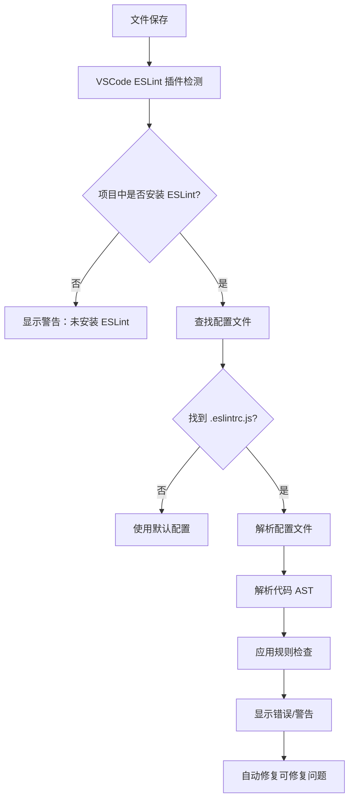

# ESLint + Prettier 完整配置指南

> 基于实际项目配置经验，为 Monorepo 项目提供完整的代码质量和格式化解决方案

## 📋 目录

- [配置概览](#配置概览)
- [核心原理解析](#核心原理解析)
- [完整配置流程](#完整配置流程)
- [`.eslintrc.js` 深度解析](#eslintrcjs-深度解析)
- [Monorepo 特殊配置](#monorepo-特殊配置)
- [VSCode 集成配置](#vscode-集成配置)
- [常见问题与解决方案](#常见问题与解决方案)
- [最佳实践建议](#最佳实践建议)
- [验证与测试](#验证与测试)

## 配置概览

### 🎯 配置目标

本指南将帮助你在 Monorepo 项目中建立：

- **统一的代码风格**：通过 Prettier 确保团队代码格式一致
- **代码质量检查**：通过 ESLint 发现潜在问题和最佳实践违规
- **多框架支持**：同时支持 TypeScript、React、Vue 等技术栈
- **开发体验优化**：保存时自动格式化和错误修复
- **CI/CD 集成**：提供完整的脚本命令用于自动化流程

### 📊 支持的文件类型

| 文件类型 | ESLint 检查 | Prettier 格式化 | 特殊规则           |
| -------- | ----------- | --------------- | ------------------ |
| `.ts`    | ✅          | ✅              | TypeScript 规则    |
| `.tsx`   | ✅          | ✅              | React + TypeScript |
| `.js`    | ✅          | ✅              | 基础 JavaScript    |
| `.jsx`   | ✅          | ✅              | React + JavaScript |
| `.vue`   | ✅          | ✅              | Vue 3 组件规则     |

## 核心原理解析

### 🔍 ESLint 工作流程



### 🎨 Prettier 集成机制


### 📁 配置文件优先级

ESLint 按以下顺序查找配置文件：

1. `.eslintrc.js` （推荐，支持注释和动态配置）
2. `.eslintrc.cjs`
3. `.eslintrc.yaml` / `.eslintrc.yml`
4. `.eslintrc.json`
5. `package.json` 中的 `eslintConfig` 字段

## 完整配置流程

### 第一步：安装必要依赖

```bash
# 核心依赖
pnpm add -D -w eslint prettier

# TypeScript 支持（必需）
pnpm add -D -w @typescript-eslint/eslint-plugin @typescript-eslint/parser

# ESLint 与 Prettier 集成（必需）
pnpm add -D -w eslint-config-prettier eslint-plugin-prettier

# Vue 支持
pnpm add -D -w eslint-plugin-vue

# React 支持
pnpm add -D -w eslint-plugin-react eslint-plugin-react-hooks
```

**依赖说明**：

- `@typescript-eslint/eslint-plugin`：提供 TypeScript 特定的 ESLint 规则
- `@typescript-eslint/parser`：让 ESLint 能够解析 TypeScript 代码
- `eslint-config-prettier`：禁用与 Prettier 冲突的 ESLint 规则
- `eslint-plugin-prettier`：将 Prettier 作为 ESLint 规则运行

### 第二步：创建 ESLint 配置

创建 `.eslintrc.js`：

```javascript
module.exports = {
  root: true,
  env: {
    browser: true,
    es2020: true,
    node: true,
  },
  extends: [
    'eslint:recommended',
    '@typescript-eslint/recommended',
    'plugin:prettier/recommended', // 必须放在最后
  ],
  parser: '@typescript-eslint/parser',
  parserOptions: {
    ecmaVersion: 2020,
    sourceType: 'module',
    ecmaFeatures: {
      jsx: true,
    },
  },
  plugins: ['@typescript-eslint', 'prettier', 'vue', 'react', 'react-hooks'],
  rules: {
    'prettier/prettier': 'error',
    '@typescript-eslint/no-unused-vars': ['error', { argsIgnorePattern: '^_' }],
    '@typescript-eslint/no-explicit-any': 'warn',
  },
  ignorePatterns: [
    'dist',
    'node_modules',
    '.turbo',
    'coverage',
    '*.d.ts',
    '!src/**/*.d.ts', // 但允许 src 目录下的类型声明文件
    '.eslintcache',
    'pnpm-lock.yaml',
    '*.config.js',
    '*.config.ts',
  ],
  overrides: [
    // Vue 文件特殊配置
    {
      files: ['*.vue'],
      extends: ['plugin:vue/recommended'],
      parser: 'vue-eslint-parser',
      parserOptions: {
        parser: '@typescript-eslint/parser',
      },
    },
    // React 文件特殊配置
    {
      files: ['*.jsx', '*.tsx'],
      extends: ['plugin:react/recommended', 'plugin:react-hooks/recommended'],
      settings: {
        react: {
          version: 'detect',
        },
      },
    },
  ],
};
```

**配置要点**：

- `root: true`：防止 ESLint 向上查找配置文件
- `overrides`：为不同文件类型提供特殊配置
- `ignorePatterns`：在配置文件中直接忽略文件，比 `.eslintignore` 更灵活

### 第三步：创建 Prettier 配置

创建 `.prettierrc`：

```json
{
  "semi": true,
  "trailingComma": "es5",
  "singleQuote": true,
  "printWidth": 80,
  "tabWidth": 2,
  "useTabs": false,
  "endOfLine": "lf",
  "bracketSpacing": true,
  "bracketSameLine": false,
  "arrowParens": "avoid"
}
```

**配置说明**：

- `singleQuote: true`：使用单引号
- `trailingComma: "es5"`：在 ES5 兼容的地方添加尾随逗号
- `printWidth: 80`：每行最大字符数
- `endOfLine: "lf"`：统一使用 LF 换行符

### 第四步：创建忽略文件

创建 `.eslintignore`：

```
# 依赖目录
node_modules/
**/node_modules/

# 构建输出
dist/
build/
lib/
out/
.next/
.nuxt/
.output/

# 缓存目录
.turbo/
.cache/
.parcel-cache/
.eslintcache
.stylelintcache

# 覆盖率报告
coverage/
.nyc_output/

# 类型声明文件
*.d.ts
!src/**/*.d.ts

# 日志文件
*.log
npm-debug.log*
yarn-debug.log*
yarn-error.log*
pnpm-debug.log*

# 环境变量文件
.env
.env.local
.env.development.local
.env.test.local
.env.production.local

# 编辑器和IDE
.vscode/
.idea/
*.swp
*.swo

# 操作系统
.DS_Store
Thumbs.db

# 包管理器
pnpm-lock.yaml
yarn.lock
package-lock.json

# 特定框架/工具
.vercel/
.netlify/
.firebase/
.serverless/

# Monorepo 特定
.changeset/
.turbo/
```

创建 `.prettierignore`：

```
node_modules/
dist/
.turbo/
coverage/
*.d.ts
.eslintcache
pnpm-lock.yaml
.pnpm-debug.log*
.DS_Store
*.log
.vscode/
.idea/
*.min.js
*.min.css
public/
build/
.next/
.nuxt/
.output/
.vercel/
.netlify/
```

### 第五步：配置 package.json 脚本

在 `package.json` 中添加脚本：

```json
{
  "scripts": {
    "lint": "eslint . --ext .js,.jsx,.ts,.tsx,.vue",
    "lint:fix": "eslint . --ext .js,.jsx,.ts,.tsx,.vue --fix",
    "format": "prettier --write .",
    "format:check": "prettier --check ."
  }
}
```

## `.eslintrc.js` 深度解析

`.eslintrc.js` 是 ESLint 配置的核心，理解其中的每个字段对于维护和扩展代码质量规则至关重要。

```javascript
// .eslintrc.js - 完整示例
module.exports = {
  // ... configuration ...
};
```

这是一个标准的 Node.js 模块，导出一个配置对象。使用 `.js` 文件作为配置文件的好处是你可以使用 JavaScript 逻辑，比如动态计算路径或添加注释。

---

### `root: true`

```javascript
  root: true,
```

- **作用**：告诉 ESLint 这是项目的根配置文件。
- **为什么重要**：当 ESLint 在检查一个文件时，它会从文件所在目录开始，逐级向上查找配置文件（`.eslintrc.js`, `.eslintrc.json` 等）并合并它们。`root: true` 会阻止 ESLint 继续向上查找。在 Monorepo 项目中，这是**必须的**，它能确保所有子包都使用这个根配置，而不会意外地受到项目外部配置文件的影响。

---

### `env`

```javascript
  env: {
    browser: true,
    es2020: true,
    node: true,
  },
```

- **作用**：指定代码运行的环境。每个环境都预定义了一组全局变量。
- **详解**：
  - `browser: true`：添加浏览器环境的全局变量，如 `window`、`document`、`console` 等。这对于前端代码是必需的。
  - `node: true`：添加 Node.js 环境的全局变量，如 `process`、`require`、`__dirname` 等。这对于配置文件、脚本和后端代码是必需的。
  - `es2020: true`：启用 ES2020 语法，并添加相应的全局变量，如 `BigInt` 和 `globalThis`。

---

### `extends`

```javascript
  extends: [
    'eslint:recommended',
    'plugin:@typescript-eslint/recommended',
    'plugin:prettier/recommended', // 必须放在最后
  ],
```

- **作用**：继承一组预定义的规则配置。这是配置的核心，可以让你快速启用一系列最佳实践规则。
- **顺序很重要**：后面的配置会覆盖前面的配置。
- **详解**：
  - `'eslint:recommended'`：启用 ESLint 官方推荐的核心规则，这些规则通常用于捕捉常见的代码错误。
  - `'plugin:@typescript-eslint/recommended'`：启用 `@typescript-eslint/eslint-plugin` 插件中推荐的 TypeScript 规则。
  - `'plugin:prettier/recommended'`：这是一个非常方便的快捷方式，它实际上做了三件事：
    1.  启用了 `eslint-plugin-prettier` 插件。
    2.  应用了 `eslint-config-prettier` 的配置，它会**禁用**所有与 Prettier 格式化规则冲突的 ESLint 规则。
    3.  将 `prettier/prettier` 规则设置为 `"error"` 级别。
    - **必须放在最后**：确保它能覆盖其他配置，成功禁用冲突的格式化规则。

---

### `parser` 和 `parserOptions`

```javascript
  parser: '@typescript-eslint/parser',
  parserOptions: {
    ecmaVersion: 2020,
    sourceType: 'module',
    ecmaFeatures: {
      jsx: true,
    },
  },
```

- **作用**：告诉 ESLint 如何将你的代码转换成 AST（抽象语法树），以便进行分析。
- **详解**：
  - `parser: '@typescript-eslint/parser'`：指定使用 `@typescript-eslint/parser` 作为解析器。默认的解析器（Espree）只支持标准 JavaScript，而这个解析器能够理解 TypeScript 的语法。
  - `parserOptions`：为解析器提供额外的配置。
    - `ecmaVersion: 2020`：指定使用的 ECMAScript 语法版本。
    - `sourceType: 'module'`：指定代码使用 ECMAScript 模块（`import`/`export` 语法）。
    - `ecmaFeatures: { jsx: true }`：启用对 JSX 语法的解析，这对于 React/TSX 文件是必需的。

---

### `plugins`

```javascript
  plugins: ['@typescript-eslint', 'prettier', 'vue', 'react', 'react-hooks'],
```

- **作用**：加载 ESLint 插件。插件可以提供额外的规则、配置、解析器或处理器。
- **详解**：
  - `'@typescript-eslint'`：加载 TypeScript 插件，提供 TypeScript 相关的规则。
  - `'prettier'`：加载 Prettier 插件，将 Prettier 作为 ESLint 规则运行。
  - `'vue'`：加载 Vue 插件，提供对 `.vue` 文件单文件组件的检查能力。
  - `'react'`：加载 React 插件，提供 React 相关的规则。
  - `'react-hooks'`：加载 React Hooks 插件，提供检查 Hooks 使用规则的能力（如 `useEffect` 的依赖项）。

---

### `rules`

```javascript
  rules: {
    'prettier/prettier': 'error',
    '@typescript-eslint/no-unused-vars': ['error', { argsIgnorePattern: '^_' }],
    '@typescript-eslint/no-explicit-any': 'warn',
  },
```

- **作用**：自定义或覆盖从 `extends` 继承的规则。
- **详解**：
  - `'prettier/prettier': 'error'`：将 Prettier 发现的格式问题报告为 ESLint 错误。这是 `eslint-plugin-prettier` 提供的核心规则。
  - `'@typescript-eslint/no-unused-vars': [...]`：自定义“未使用变量”规则。
    - `argsIgnorePattern: '^_`：允许函数参数以 `_` 开头但未使用，这在某些回调函数中很常见。
  - `'@typescript-eslint/no-explicit-any': 'warn'`：将“禁止使用 `any` 类型”的规则级别从 `error` 降级为 `warn`。这在项目初期或迁移过程中很有用，可以逐步消除 `any` 而不阻塞开发。

---

### `ignorePatterns`

```javascript
  ignorePatterns: [
    'dist', 'node_modules', '.turbo', 'coverage', '*.d.ts',
    '!src/**/*.d.ts', // 但允许 src 目录下的类型声明文件
    '.eslintcache', 'pnpm-lock.yaml', '*.config.js', '*.config.ts',
  ],
```

- **作用**：告诉 ESLint 忽略哪些文件或目录，效果类似于 `.eslintignore` 文件。
- **详解**：
  - 这里列出的是常见的构建输出、依赖、缓存和配置文件。
  - `!src/**/*.d.ts`：这是一个**否定模式**。`*.d.ts` 忽略了所有声明文件，但这一行**重新包含了** `src` 目录下的声明文件，因为这些可能是你手写的类型定义，需要被检查。

---

### `overrides`

```javascript
  overrides: [
    // Vue 文件特殊配置
    {
      files: ['*.vue'],
      extends: ['plugin:vue/recommended'],
      parser: 'vue-eslint-parser',
      parserOptions: {
        parser: '@typescript-eslint/parser',
      },
    },
    // React 文件特殊配置
    {
      files: ['*.jsx', '*.tsx'],
      extends: ['plugin:react/recommended', 'plugin:react-hooks/recommended'],
      settings: {
        react: {
          version: 'detect',
        },
      },
    },
  ],
```

- **作用**：为特定文件类型应用不同的配置。这在需要支持多种框架的 Monorepo 项目中是**至关重要的**。
- **详解**：
  - **Vue 文件配置**：
    - `files: ['*.vue']`：只对 `.vue` 文件应用这个配置。
    - `extends: ['plugin:vue/recommended']`：应用 Vue 3 推荐的规则。
    - `parser: 'vue-eslint-parser'`：使用一个特殊的解析器，它能理解 `.vue` 文件的结构（`<template>`, `<script>`, `<style>`）。
    - `parserOptions: { parser: '@typescript-eslint/parser' }`：告诉 `vue-eslint-parser` 在解析 `<script>` 标签时，内部使用 `@typescript-eslint/parser`，这样你就可以在 Vue 中使用 TypeScript。
  - **React 文件配置**：
    - `files: ['*.jsx', '*.tsx']`：对所有 JSX 和 TSX 文件应用这个配置。
    - `extends: [...]`：应用 React 和 React Hooks 的推荐规则。
    - `settings: { react: { version: 'detect' } }`：让 ESLint 自动检测项目中安装的 React 版本，以应用相应的规则。

---

### 总结

这个 `.eslintrc.js` 文件通过组合使用 `extends`, `plugins`, `parser`, 和 `overrides`，构建了一个强大且灵活的配置，能够：

1.  ✅ **建立统一的基础规则**
2.  ✅ **支持 TypeScript 语法**
3.  ✅ **集成 Prettier 进行格式化**
4.  ✅ **为 React 和 Vue 提供专门的规则集**
5.  ✅ **在 Monorepo 结构下和谐共存**

## Monorepo 特殊配置

### 🏗️ 项目结构

```
translink-i18n/
├── .eslintrc.js              # 根配置（全局规则）
├── .prettierrc               # 全局 Prettier 配置
├── .eslintignore             # 全局忽略文件
├── .prettierignore           # Prettier 忽略文件
├── packages/
│   ├── cli/                  # CLI 包
│   ├── runtime/              # 运行时包
│   └── vite-plugin/          # Vite 插件包
├── apps/
│   └── playground/
│       ├── react-demo/       # React 演示应用
│       ├── vue-demo/         # Vue 演示应用
│       ├── typescript-demo/  # TypeScript 演示
│       └── javascript-demo/  # JavaScript 演示
└── .vscode/
    └── settings.json         # VSCode 工作区配置
```

### 🎯 工作区配置策略

对于 Monorepo，建议采用**单一根配置**策略：

**优势**：

- 统一的代码风格和质量标准
- 简化配置管理
- 避免配置冲突
- 更好的性能（单一配置文件）

**实现方式**：

- 在根目录放置主配置文件
- 使用 `overrides` 为不同类型文件提供特殊规则
- 通过 `eslint.workingDirectories` 指定工作目录

## VSCode 集成配置

### 🔧 工作区设置

创建 `.vscode/settings.json`：

```json
{
  "editor.formatOnSave": true,
  "editor.codeActionsOnSave": {
    "source.fixAll.eslint": "explicit"
  },
  "editor.defaultFormatter": "esbenp.prettier-vscode",
  "eslint.validate": [
    "javascript",
    "javascriptreact",
    "typescript",
    "typescriptreact",
    "vue"
  ],
  "eslint.workingDirectories": [
    "./packages/cli",
    "./packages/runtime",
    "./packages/vite-plugin",
    "./apps/playground/react-demo",
    "./apps/playground/vue-demo",
    "./apps/playground/typescript-demo",
    "./apps/playground/javascript-demo"
  ],
  "[typescript]": {
    "editor.defaultFormatter": "esbenp.prettier-vscode"
  },
  "[javascript]": {
    "editor.defaultFormatter": "esbenp.prettier-vscode"
  },
  "[vue]": {
    "editor.defaultFormatter": "esbenp.prettier-vscode"
  },
  "[typescriptreact]": {
    "editor.defaultFormatter": "esbenp.prettier-vscode"
  },
  "[javascriptreact]": {
    "editor.defaultFormatter": "esbenp.prettier-vscode"
  }
}
```

**关键配置说明**：

- `"source.fixAll.eslint": "explicit"`：保存时自动修复 ESLint 问题
- `eslint.workingDirectories`：为 Monorepo 中的每个包指定独立的工作目录
- 语言特定的格式化器配置：确保所有支持的文件类型都使用 Prettier

### 📦 必需的 VSCode 扩展

确保安装以下扩展：

1. **ESLint** (`dbaeumer.vscode-eslint`)
2. **Prettier - Code formatter** (`esbenp.prettier-vscode`)
3. **Vetur** (Vue 项目) 或 **Volar** (Vue 3 项目)

### 🎛️ workingDirectories 的作用

`eslint.workingDirectories` 是 Monorepo 配置的关键：

- **独立实例**：为每个目录创建独立的 ESLint 实例
- **配置隔离**：每个实例从对应目录开始查找配置
- **依赖解析**：正确解析各自的 `node_modules` 依赖
- **性能优化**：避免扫描整个项目，只处理相关文件

## 常见问题与解决方案

### ❌ 问题1：保存时自动格式化不生效

**可能原因**：

1. VSCode 配置文件名错误（应该是 `settings.json` 不是 `setting.json`）
2. 未安装 Prettier 扩展
3. 配置文件语法错误

**解决方案**：

```bash
# 1. 检查文件名
ls .vscode/settings.json

# 2. 测试 Prettier 是否工作
npx prettier --check src/

# 3. 验证 VSCode 扩展
# 在 VSCode 中按 Ctrl+Shift+P，输入 "Prettier: Check Configuration"
```

### ❌ 问题2：ESLint 找不到 Vue/React 配置

**症状**：

```
ESLint couldn't find the config "plugin:vue/recommended" to extend from
```

**解决方案**：

```bash
# 确保安装了相应插件
pnpm list eslint-plugin-vue
pnpm list eslint-plugin-react

# 检查插件是否在 plugins 数组中
# .eslintrc.js
plugins: ['@typescript-eslint', 'prettier', 'vue', 'react', 'react-hooks']
```

### ❌ 问题3：ESLint 和 Prettier 规则冲突

**症状**：保存时代码被反复格式化

**解决方案**：

```javascript
// 确保 plugin:prettier/recommended 在 extends 数组最后
{
  "extends": [
    "eslint:recommended",
    "@typescript-eslint/recommended",
    "plugin:prettier/recommended" // 必须最后
  ]
}
```

### ❌ 问题4：Monorepo 中某些包不生效

**解决方案**：

1. 检查 `eslint.workingDirectories` 配置
2. 确保包含所有需要检查的目录
3. 重启 VSCode 使配置生效

### ❌ 问题5：TypeScript 类型检查过慢

**解决方案**：

```javascript
// .eslintrc.js - 优化性能
{
  parserOptions: {
    project: ['./tsconfig.json', './packages/*/tsconfig.json'],
    tsconfigRootDir: __dirname,
  },
  // 或者禁用类型检查规则
  extends: [
    '@typescript-eslint/recommended', // 而不是 recommended-requiring-type-checking
  ]
}
```

## 最佳实践建议

### 🚀 性能优化

#### 1. 使用 ESLint 缓存

```json
{
  "scripts": {
    "lint": "eslint . --cache --cache-location .eslintcache --ext .js,.jsx,.ts,.tsx,.vue"
  }
}
```

#### 2. 配置合理的忽略规则

- 使用 `.eslintignore` 和 `.prettierignore` 忽略不需要检查的文件
- 在 `ignorePatterns` 中配置动态忽略规则
- 避免检查第三方库和构建产物

#### 3. Turbo 集成

```json
// turbo.json
{
  "pipeline": {
    "lint": {
      "inputs": ["src/**/*.{ts,tsx,js,jsx,vue}", ".eslintrc.js", ".prettierrc"],
      "outputs": [".eslintcache"]
    },
    "format": {
      "inputs": ["src/**/*.{ts,tsx,js,jsx,vue,json,md}", ".prettierrc"],
      "outputs": []
    }
  }
}
```

### 🔒 Git Hooks 集成（推荐）

```bash
# 安装 husky 和 lint-staged
pnpm add -D -w husky lint-staged

# 初始化 husky
npx husky install

# 添加 pre-commit hook
npx husky add .husky/pre-commit "npx lint-staged"
```

在 `package.json` 中配置：

```json
{
  "lint-staged": {
    "*.{js,jsx,ts,tsx,vue}": ["eslint --fix", "prettier --write"],
    "*.{json,md,yml,yaml}": ["prettier --write"]
  }
}
```

### 📊 CI/CD 集成

```yaml
# .github/workflows/quality.yml
name: Code Quality

on: [push, pull_request]

jobs:
  quality:
    runs-on: ubuntu-latest
    steps:
      - uses: actions/checkout@v3

      - name: Setup Node.js
        uses: actions/setup-node@v3
        with:
          node-version: '18'

      - name: Install pnpm
        uses: pnpm/action-setup@v2
        with:
          version: 8

      - name: Install dependencies
        run: pnpm install --frozen-lockfile

      - name: Lint check
        run: pnpm lint

      - name: Format check
        run: pnpm format:check

      - name: Type check
        run: pnpm type-check
```

### 🎯 团队协作规范

#### 1. 统一开发环境

- 提供 `.vscode/extensions.json` 推荐扩展
- 在 README 中说明必需的 VSCode 扩展
- 使用 `.editorconfig` 统一编辑器配置

#### 2. 渐进式规则启用

```javascript
// 开发阶段：宽松规则
rules: {
  '@typescript-eslint/no-explicit-any': 'warn',
  '@typescript-eslint/no-unused-vars': 'warn',
}

// 生产阶段：严格规则
rules: {
  '@typescript-eslint/no-explicit-any': 'error',
  '@typescript-eslint/no-unused-vars': 'error',
}
```

#### 3. 代码审查集成

- 在 PR 模板中包含代码质量检查项
- 使用 GitHub Actions 自动运行检查
- 设置分支保护规则要求通过检查

## 验证与测试

### 🧪 配置验证命令

```bash
# 检查 ESLint 配置是否正确
npx eslint --print-config src/index.ts

# 检查 Prettier 配置
npx prettier --check src/

# 测试特定文件类型
npx eslint --ext .vue apps/playground/vue-demo/src/
npx eslint --ext .tsx apps/playground/react-demo/src/

# 运行完整检查
pnpm lint
pnpm format:check
pnpm type-check
```

### 📋 验证清单

- [ ] TypeScript 文件能正确检查和格式化
- [ ] React 文件支持 JSX 语法和 Hooks 规则
- [ ] Vue 文件支持模板语法和组件规则
- [ ] 保存时自动格式化正常工作
- [ ] ESLint 错误在 VSCode 中正确显示
- [ ] 所有 Monorepo 包都能正确检查
- [ ] Git hooks 正常工作（如果配置）
- [ ] CI/CD 检查通过

### 🎯 性能基准

良好配置的性能指标：

- **首次 ESLint 运行**：< 10 秒（中等项目）
- **缓存后运行**：< 3 秒
- **单文件检查**：< 1 秒
- **Prettier 格式化**：< 2 秒

## 📚 相关资源

### 官方文档

- [ESLint 官方文档](https://eslint.org/docs/)
- [Prettier 官方文档](https://prettier.io/docs/)
- [TypeScript ESLint 文档](https://typescript-eslint.io/)
- [Vue ESLint 插件](https://eslint.vuejs.org/)
- [React ESLint 插件](https://github.com/jsx-eslint/eslint-plugin-react)

### VSCode 扩展

- [ESLint 扩展](https://marketplace.visualstudio.com/items?itemName=dbaeumer.vscode-eslint)
- [Prettier 扩展](https://marketplace.visualstudio.com/items?itemName=esbenp.prettier-vscode)
- [Volar (Vue 3)](https://marketplace.visualstudio.com/items?itemName=Vue.volar)

### 工具集成

- [Husky - Git Hooks](https://typicode.github.io/husky/)
- [lint-staged - 暂存文件检查](https://github.com/okonet/lint-staged)
- [Turbo - Monorepo 构建工具](https://turbo.build/)

---

## 🎉 总结

通过本指南的配置，你将获得：

✅ **统一的代码风格**：团队成员编写的代码风格完全一致  
✅ **自动化质量检查**：在编码阶段就发现并修复问题  
✅ **多技术栈支持**：TypeScript、React、Vue 等无缝集成  
✅ **优秀的开发体验**：保存即格式化，实时错误提示  
✅ **完整的工程化流程**：从开发到 CI/CD 的全流程覆盖

这套配置已在实际项目中验证，能够显著提升代码质量和开发效率。建议按照指南逐步配置，遇到问题时参考常见问题解决方案。

**记住**：好的工具配置是高质量代码的基础，投入时间完善开发环境配置，将在长期开发中获得巨大收益。
