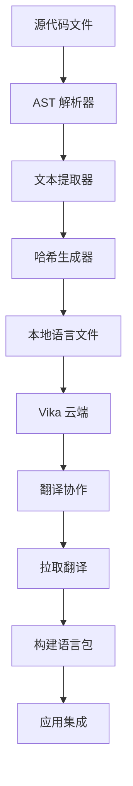

# TransLink I18n CLI 工具核心开发教程

> 本教程详细记录了如何开发一个功能完整的国际化 CLI 工具，包括 AST 文本提取、智能哈希生成、云端集成等核心功能。

## 📋 目标概述

在第一阶段完成基础架构搭建后，我们将实现 CLI 工具的核心功能：

- 🔍 **智能文本提取**: 基于 AST 的多语言文件解析
- 🔐 **智能哈希生成**: 防碰撞的翻译键生成算法
- ☁️ **云端集成**: Vika 表格的翻译协作管理
- 🛠️ **完整命令集**: extract、build、push、pull、analyze
- 📊 **分析报告**: 翻译覆盖率和质量分析

## 🎯 最终实现效果

完成本教程后，你将拥有一个功能完整的 CLI 工具：

```bash
# 初始化配置
translink init

# 扫描并提取翻译
translink extract --verbose

# 构建语言包
translink build --minify

# 推送到云端
translink push

# 从云端拉取翻译
translink pull --merge

# 分析翻译质量
translink analyze --include-cloud --format html
```

## 🏗️ 核心架构设计

### 模块划分

```
packages/cli/src/
├── commands/           # 命令实现
│   ├── init.ts        # 初始化配置
│   ├── extract.ts     # 文本提取
│   ├── build.ts       # 语言包构建
│   ├── push.ts        # 推送到云端
│   ├── pull.ts        # 从云端拉取
│   └── analyze.ts     # 分析报告
├── extractors/         # 文本提取器
│   └── ast-extractor.ts
├── generators/         # 哈希生成器
│   └── hash-generator.ts
├── integrations/       # 第三方集成
│   └── vika-client.ts
├── utils/             # 工具函数
│   ├── config.ts      # 配置管理
│   └── logger.ts      # 日志系统
└── types/             # 类型定义
    └── config.ts
```

### 数据流设计



## 🚀 实施步骤

### 第一步：智能哈希生成器

哈希生成器是整个系统的核心，负责为每个翻译文本生成唯一且稳定的标识符。

#### 核心算法设计

创建 `packages/cli/src/generators/hash-generator.ts`：

```typescript
import { createHash } from 'crypto';
import type { I18nConfig } from '../types/config.js';

export interface HashContext {
  filePath: string;
  componentName?: string;
  functionName?: string;
  namespace?: string;
}

export class HashGenerator {
  private collisionMap = new Map<string, { content: string; context: HashContext }[]>();
  private config: I18nConfig['hash'];

  constructor(config: I18nConfig['hash']) {
    this.config = config;
  }

  /**
   * 生成翻译键的哈希值
   * 采用混合智能哈希算法，优先基于内容，发生碰撞时添加上下文
   */
  generate(content: string, context: HashContext): string {
    // 1. 生成基础内容哈希
    const contentHash = this.generateContentHash(content, this.config.algorithm, this.config.length);
    
    // 2. 检查哈希冲突
    if (!this.hasCollision(contentHash, content, context)) {
      this.recordHash(contentHash, content, context);
      return contentHash;
    }

    // 3. 发生冲突，添加上下文信息
    const contextualHash = this.generateContextualHash(content, context);
    this.recordHash(contextualHash, content, context);
    return contextualHash;
  }

  private generateContentHash(content: string, algorithm: string, length: number): string {
    // 标准化内容：去除多余空格、统一换行符
    const normalizedContent = content
      .replace(/\s+/g, ' ')
      .replace(/\r\n|\r/g, '\n')
      .trim();
    
    const hash = createHash(algorithm);
    hash.update(normalizedContent, 'utf8');
    return hash.digest('hex').substring(0, length);
  }

  private generateContextualHash(content: string, context: HashContext): string {
    const contextParts: string[] = [];
    
    // 构建上下文字符串
    for (const field of this.config.contextFields) {
      const value = this.getContextValue(context, field);
      if (value) {
        contextParts.push(`${field}:${value}`);
      }
    }

    // 如果没有有效的上下文，使用文件路径的最后部分
    if (contextParts.length === 0) {
      const fileName = context.filePath.split('/').pop() || 'unknown';
      contextParts.push(`file:${fileName}`);
    }

    const contextString = contextParts.join('|');
    const combinedContent = `${content}::${contextString}`;
    
    return this.generateContentHash(combinedContent, this.config.algorithm, this.config.length);
  }
}
```

#### 关键特性解析

1. **混合智能算法**：
   - 优先基于内容生成哈希，确保相同文本有相同key
   - 检测到冲突时自动添加上下文信息
   - 支持多种哈希算法（MD5、SHA-1、SHA-256）

2. **冲突处理机制**：
   - 实时检测哈希冲突
   - 智能选择上下文字段（文件名、组件名、函数名）
   - 提供冲突统计和分析功能

3. **稳定性保证**：
   - 相同内容在相同上下文下生成相同哈希
   - 内容标准化处理，忽略格式差异
   - 支持哈希验证和稳定性测试

### 第二步：AST 文本提取器

文本提取器负责从各种类型的源代码文件中智能提取需要翻译的中文文本。

#### 多语言文件支持

创建 `packages/cli/src/extractors/ast-extractor.ts`：

```typescript
import $ from 'gogocode';
import { readFileSync } from 'fs';
import { glob } from 'glob';

export class ASTExtractor {
  private config: I18nConfig['extract'];
  private hashGenerator: HashGenerator;

  /**
   * 从项目中提取所有翻译文本
   */
  async extractFromProject(cwd: string = process.cwd()): Promise<ExtractResult[]> {
    const files = await this.scanFiles(cwd);
    const results: ExtractResult[] = [];
    
    for (const filePath of files) {
      const fileResults = await this.extractFromFile(filePath, cwd);
      results.push(...fileResults);
    }
    
    return this.deduplicateResults(results);
  }

  /**
   * 根据文件类型选择不同的解析策略
   */
  private async extractFromFile(filePath: string, cwd: string): Promise<ExtractResult[]> {
    const content = readFileSync(filePath, 'utf-8');
    const relativePath = relative(cwd, filePath);
    const fileExtension = this.getFileExtension(filePath);
    
    switch (fileExtension) {
      case '.vue':
        return this.extractFromVueFile(content, relativePath);
      case '.tsx':
      case '.jsx':
        return this.extractFromJSXFile(content, relativePath);
      case '.ts':
      case '.js':
        return this.extractFromJSFile(content, relativePath);
      default:
        return this.extractFromJSFile(content, relativePath);
    }
  }

  /**
   * 从 Vue 文件提取翻译文本
   */
  private extractFromVueFile(content: string, filePath: string): ExtractResult[] {
    const results: ExtractResult[] = [];
    
    try {
      const ast = $(content, { parseOptions: { language: 'vue' } });
      
      // 处理 <script> 部分
      ast.find('<script>').each((scriptNode) => {
        const scriptContent = scriptNode.attr('content') || '';
        if (scriptContent.trim()) {
          const scriptResults = this.extractFromJSContent(scriptContent, filePath);
          results.push(...scriptResults);
        }
      });
      
      // 处理 <template> 部分
      ast.find('<template>').each((templateNode) => {
        const templateResults = this.extractFromTemplate(templateNode, filePath);
        results.push(...templateResults);
      });
      
    } catch (error) {
      // 降级到普通 JS 解析
      return this.extractFromJSContent(content, filePath);
    }
    
    return results;
  }
}
```

#### 智能文本识别

```typescript
/**
 * 从 AST 中提取翻译函数调用
 */
private extractFromAST(ast: any, filePath: string): ExtractResult[] {
  const results: ExtractResult[] = [];
  
  // 查找翻译函数调用
  ast.find('CallExpression').each((node: any) => {
    const callee = node.attr('callee');
    const functionName = this.getFunctionName(callee);
    
    if (this.config.functions.includes(functionName)) {
      const args = node.attr('arguments');
      const textArg = args?.[0];
      
      if (textArg && this.isStringLiteral(textArg)) {
        const text = textArg.value;
        
        if (this.isChineseText(text)) {
          const context = this.extractContext(node, filePath);
          const key = this.hashGenerator.generate(text, context);
          
          results.push({
            key,
            text,
            filePath,
            line: node.attr('loc.start.line') || 0,
            column: node.attr('loc.start.column') || 0,
            context: {
              componentName: context.componentName,
              functionName: context.functionName,
              namespace: context.namespace,
            },
          });
        }
      }
    }
  });
  
  return results;
}
```

#### 支持的提取模式

1. **JavaScript/TypeScript**：
   - `t('文本')` - 标准翻译函数
   - `$tsl('文本')` - 自定义翻译函数
   - `i18n.t('文本')` - 对象方法调用

2. **Vue 模板**：
   - `{{ t('文本') }}` - 插值表达式
   - `v-t="'文本'"` - 自定义指令

3. **JSX/TSX**：
   - `{t('文本')}` - JSX 表达式
   - 组件属性中的翻译调用

### 第三步：命令实现

#### extract 命令

创建 `packages/cli/src/commands/extract.ts`：

```typescript
import { Command } from 'commander';
import { writeFileSync, existsSync, mkdirSync } from 'fs';

async function extractCommand(options: ExtractOptions) {
  logger.title('提取翻译文本');

  // 加载配置
  const config = await configManager.loadConfig();
  
  // 初始化提取器
  const hashGenerator = new HashGenerator(config.hash);
  const extractor = new ASTExtractor(config.extract, hashGenerator);

  // 执行提取
  const results = await extractor.extractFromProject();
  
  // 显示统计信息
  const stats = extractor.getStats();
  const hashStats = hashGenerator.getCollisionStats();
  
  logger.success('📊 提取统计:');
  logger.info(`  扫描文件: ${stats.totalFiles} 个`);
  logger.info(`  提取文本: ${stats.chineseTexts} 个`);
  logger.info(`  生成哈希: ${hashStats.totalHashes} 个`);

  // 生成语言文件
  await generateLanguageFiles(results, config);
}

export const extract = new Command('extract')
  .description('扫描代码并提取翻译文本')
  .option('-p, --pattern <patterns...>', '扫描文件模式')
  .option('-o, --output <directory>', '输出目录')
  .option('--dry-run', '试运行，不写入文件')
  .option('-v, --verbose', '显示详细信息')
  .action(extractCommand);
```

#### build 命令

构建命令负责将原始翻译文件转换为优化的语言包：

```typescript
async function buildCommand(options: BuildOptions) {
  logger.title('构建语言包');

  const config = await configManager.loadConfig();
  
  // 读取所有语言文件
  const languageFiles = await scanLanguageFiles(inputPath);
  
  // 构建语言包
  const buildStats = await buildLanguagePacks(languageFiles, outputDir, options);

  // 显示构建统计
  logger.success('📊 构建统计:');
  logger.info(`  语言数量: ${buildStats.languages}`);
  logger.info(`  翻译键数: ${buildStats.keys}`);
  logger.info(`  总大小: ${formatBytes(buildStats.totalSize)}`);
}
```

### 第四步：Vika 云端集成

#### API 客户端设计

创建 `packages/cli/src/integrations/vika-client.ts`：

```typescript
export class VikaClient {
  private apiKey: string;
  private datasheetId: string;
  private baseURL = 'https://vika.cn/fusion/v1';

  /**
   * 推送翻译项到 Vika
   */
  async pushTranslations(translations: TranslationItem[]): Promise<{
    created: number;
    updated: number;
    errors: number;
  }> {
    const stats = { created: 0, updated: 0, errors: 0 };
    const batchSize = 10; // Vika API 批量限制

    // 获取现有记录
    const existingRecords = await this.getAllRecords();
    const existingMap = new Map<string, VikaRecord>();
    
    existingRecords.forEach(record => {
      if (record.fields.key) {
        existingMap.set(record.fields.key, record);
      }
    });

    // 分批处理
    for (let i = 0; i < translations.length; i += batchSize) {
      const batch = translations.slice(i, i + batchSize);
      const batchStats = await this.processBatch(batch, existingMap);
      
      stats.created += batchStats.created;
      stats.updated += batchStats.updated;
      stats.errors += batchStats.errors;

      // 避免 API 限流
      if (i + batchSize < translations.length) {
        await this.delay(200);
      }
    }

    return stats;
  }

  /**
   * 从 Vika 拉取翻译
   */
  async pullTranslations(language: string): Promise<Record<string, string>> {
    const records = await this.getAllRecords();
    const translations: Record<string, string> = {};

    for (const record of records) {
      const { key } = record.fields;
      const translation = record.fields[language as keyof typeof record.fields] as string;

      if (key && translation && translation.trim()) {
        translations[key] = translation.trim();
      }
    }

    return translations;
  }
}
```

#### 数据结构设计

```typescript
export interface VikaRecord {
  recordId?: string;
  fields: {
    key: string;           // 翻译键
    'zh-CN': string;       // 中文原文
    'en-US'?: string;      // 英文翻译
    'ja-JP'?: string;      // 日文翻译
    status: 'pending' | 'translated' | 'reviewed';  // 翻译状态
    context?: string;      // 上下文信息
    file?: string;         // 文件路径
    line?: number;         // 行号
    updatedAt?: string;    // 更新时间
  };
}
```

### 第五步：分析报告系统

#### analyze 命令

创建 `packages/cli/src/commands/analyze.ts`：

```typescript
async function analyzeCommand(options: AnalyzeOptions) {
  logger.title('分析翻译覆盖率');

  const config = await configManager.loadConfig();
  
  // 执行代码扫描
  const hashGenerator = new HashGenerator(config.hash);
  const extractor = new ASTExtractor(config.extract, hashGenerator);
  const extractResults = await extractor.extractFromProject();

  // 分析本地翻译文件
  const localTranslations = await analyzeLocalTranslations(inputDir, config.languages.supported);

  // 分析云端状态（如果启用）
  let cloudStatus;
  if (options.includeCloud && config.vika.apiKey) {
    const vikaClient = new VikaClient(config.vika.apiKey, config.vika.datasheetId);
    const translationStats = await vikaClient.getTranslationStats();
    cloudStatus = { connected: true, translationStats };
  }

  // 生成分析报告
  const report = generateAnalysisReport(extractResults, localTranslations, config, cloudStatus);

  // 显示分析结果
  displayAnalysisResults(report, options.verbose);

  // 保存报告文件
  if (options.output) {
    await saveAnalysisReport(report, options.output, options.format);
  }
}
```

#### 报告生成

支持多种格式的分析报告：

1. **JSON 格式**：结构化数据，便于程序处理
2. **HTML 格式**：可视化报告，支持图表展示
3. **Markdown 格式**：文档友好，便于版本控制

```typescript
function generateHTMLReport(report: AnalysisReport): string {
  return `
<!DOCTYPE html>
<html lang="zh-CN">
<head>
    <title>TransLink I18n 分析报告</title>
    <style>
        .coverage { display: flex; gap: 20px; }
        .coverage-item { padding: 15px; border-radius: 8px; }
        .high { border-left: 4px solid #4caf50; }
        .medium { border-left: 4px solid #ff9800; }
        .low { border-left: 4px solid #f44336; }
    </style>
</head>
<body>
    <h1>🔗 TransLink I18n 分析报告</h1>
    
    <div class="summary">
        <h2>📊 基础统计</h2>
        <p>扫描文件: <strong>${report.summary.totalFiles}</strong> 个</p>
        <p>中文文本: <strong>${report.summary.chineseTexts}</strong> 个</p>
    </div>

    <h2>🌐 翻译覆盖率</h2>
    <div class="coverage">
        ${Object.entries(report.summary.translationCoverage).map(([lang, coverage]) => {
          const level = coverage >= 90 ? 'high' : coverage >= 70 ? 'medium' : 'low';
          return `<div class="coverage-item ${level}">
            <h3>${lang}</h3>
            <p><strong>${coverage.toFixed(1)}%</strong></p>
          </div>`;
        }).join('')}
    </div>
</body>
</html>
  `;
}
```

## 🧪 测试与验证

### 构建和测试

```bash
# 构建 CLI 工具
cd packages/cli && pnpm build

# 测试所有命令
node dist/cli.js --help

# 测试具体命令
node dist/cli.js extract --help
node dist/cli.js build --help
node dist/cli.js analyze --help
```

### 功能验证清单

- [ ] ✅ 所有命令正确注册和显示
- [ ] ✅ 配置文件正确加载和解析
- [ ] ✅ AST 提取器正确识别中文文本
- [ ] ✅ 哈希生成器避免冲突
- [ ] ✅ 语言文件正确生成
- [ ] ✅ 构建输出符合预期格式
- [ ] ✅ Vika API 集成正常工作
- [ ] ✅ 分析报告准确生成

### 端到端测试流程

```bash
# 1. 初始化项目
translink init

# 2. 提取翻译文本
translink extract --verbose

# 3. 构建语言包
translink build --minify

# 4. 分析翻译质量
translink analyze --format html --output report.html

# 5. 推送到云端（需要配置 Vika）
# export VIKA_API_KEY="your_key"
# export VIKA_DATASHEET_ID="your_id"
# translink push

# 6. 从云端拉取翻译
# translink pull --merge
```

## 🎯 关键学习要点

### 1. AST 处理最佳实践

- **多语言支持**：针对不同文件类型采用不同解析策略
- **错误处理**：解析失败时提供降级方案
- **性能优化**：缓存解析结果，避免重复处理

### 2. 哈希算法设计

- **稳定性**：相同内容生成相同哈希
- **唯一性**：通过上下文信息避免冲突
- **可配置性**：支持不同哈希算法和长度

### 3. 云端集成策略

- **批量处理**：减少 API 调用次数
- **错误重试**：处理网络异常和限流
- **增量同步**：只同步变更的内容

### 4. 用户体验设计

- **进度反馈**：使用 spinner 显示长时间操作进度
- **详细日志**：提供 debug 模式和详细错误信息
- **友好提示**：给出下一步操作建议

## 🚀 扩展功能

### 1. 插件系统

```typescript
// 支持自定义提取器插件
interface ExtractorPlugin {
  name: string;
  fileExtensions: string[];
  extract(content: string, filePath: string): ExtractResult[];
}
```

### 2. 批量操作

```typescript
// 支持批量文件处理
translink extract --batch --parallel 4
```

### 3. 缓存优化

```typescript
// 实现智能缓存，避免重复处理
class CacheManager {
  private cache = new Map<string, any>();
  
  getCached(key: string): any {
    return this.cache.get(key);
  }
  
  setCached(key: string, value: any): void {
    this.cache.set(key, value);
  }
}
```

## ✅ 验证检查清单

- [ ] 所有命令功能正常
- [ ] AST 提取器支持多种文件类型
- [ ] 哈希生成器避免冲突
- [ ] Vika 集成正常工作
- [ ] 分析报告准确生成
- [ ] 错误处理完善
- [ ] 用户体验良好
- [ ] 性能表现满足要求

## 🎉 完成效果

完成本教程后，你将拥有一个功能完整的国际化 CLI 工具：

1. **智能文本提取**：自动识别和提取需要翻译的中文文本
2. **稳定哈希生成**：为每个文本生成唯一且稳定的标识符
3. **云端协作**：与 Vika 表格集成，支持团队翻译协作
4. **完整工作流**：从提取到构建的完整自动化流程
5. **质量分析**：提供详细的翻译覆盖率和质量报告

这个 CLI 工具不仅解决了国际化开发的痛点，还提供了现代化的开发体验和强大的扩展能力。

---

*本教程展示了如何构建一个生产级别的 CLI 工具，涵盖了从核心算法到用户体验的各个方面。*
