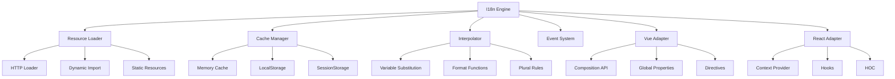

# TransLink I18n 运行时库实现教程

> 本教程详细记录了如何开发一个高性能的国际化运行时库，包括多级缓存系统、框架适配器、插值处理等核心功能。

## 📋 目标概述

在完成 CLI 工具核心开发后，我们将实现运行时库的核心功能：

- 🚀 **高性能翻译引擎**: 支持多级缓存和智能预加载
- 🔄 **多级缓存系统**: 内存 + LocalStorage + 网络的三级缓存
- 🎯 **框架深度集成**: Vue3 Composition API 和 React Hooks 支持
- 🔧 **智能插值处理**: 支持变量替换、格式化函数、组件插值
- 📦 **模块化设计**: 按需加载，支持 Tree Shaking
- ⚡ **异步加载**: 支持懒加载和并发加载语言包

## 🎯 最终实现效果

完成本教程后，你将拥有一个功能完整的运行时库：

### Vue 3 使用方式
```typescript
import { createApp } from 'vue';
import { createI18n, useI18n } from '@translink/i18n-runtime/vue';

// 创建 i18n 实例
const i18n = createI18n({
  defaultLanguage: 'zh-CN',
  supportedLanguages: ['zh-CN', 'en-US'],
  loadPath: './locales/{{lng}}.json'
});

// 在组件中使用
const { t, locale, setLocale } = useI18n();
```

### React 使用方式
```typescript
import React from 'react';
import { I18nProvider, useTranslation } from '@translink/i18n-runtime/react';

function App() {
  return (
    <I18nProvider i18n={engine}>
      <MyComponent />
    </I18nProvider>
  );
}

function MyComponent() {
  const { t, i18n } = useTranslation();
  return <h1>{t('welcome')}</h1>;
}
```

## 🏗️ 核心架构设计

### 系统架构图



### 模块设计

```
packages/runtime/src/
├── core/                   # 核心模块
│   ├── i18n-engine.ts     # 主翻译引擎
│   ├── resource-loader.ts # 资源加载器
│   └── interpolator.ts    # 插值处理器
├── cache/                 # 缓存系统
│   └── cache-manager.ts   # 多级缓存管理
├── adapters/              # 框架适配器
│   ├── vue.ts            # Vue 3 适配器
│   └── react.ts          # React 适配器
├── utils/                 # 工具函数
│   └── event-emitter.ts  # 事件系统
├── types/                 # 类型定义
│   └── index.ts
├── examples/              # 使用示例
│   ├── basic-usage.ts
│   ├── vue-usage.ts
│   └── react-usage.tsx
├── index.ts              # 主入口
├── vue.ts                # Vue 专用入口
└── react.ts              # React 专用入口
```

## 🚀 实施步骤

### 第一步：核心类型定义

创建 `packages/runtime/src/types/index.ts`：

```typescript
export interface TranslationResource {
  [key: string]: string | TranslationResource;
}

export interface I18nOptions {
  // 语言配置
  defaultLanguage: string;
  fallbackLanguage: string;
  supportedLanguages: string[];
  
  // 资源配置
  resources?: Record<string, TranslationResource>;
  loadPath?: string;
  loadFunction?: (lng: string, ns: string) => Promise<TranslationResource>;
  
  // 缓存配置
  cache?: {
    enabled: boolean;
    maxSize: number;
    ttl: number;
    storage: 'memory' | 'localStorage' | 'sessionStorage';
  };
  
  // 插值配置
  interpolation?: {
    prefix: string;
    suffix: string;
    escapeValue: boolean;
    format?: (value: any, format: string, lng: string) => string;
  };
  
  // 调试配置
  debug?: boolean;
  logLevel?: 'error' | 'warn' | 'info' | 'debug';
}

export interface TranslationParams {
  [key: string]: string | number | boolean | Date | null | undefined;
}

export interface CacheEntry<T = any> {
  value: T;
  timestamp: number;
  ttl: number;
  accessCount: number;
  lastAccessed: number;
}
```

**类型设计要点：**
- 📝 **完整的选项接口**: 覆盖所有配置需求
- 🔧 **灵活的资源类型**: 支持嵌套和扁平结构
- 💾 **缓存策略配置**: 支持多种存储方式
- 🎨 **插值系统配置**: 可自定义格式化函数

### 第二步：多级缓存系统

创建 `packages/runtime/src/cache/cache-manager.ts`：

```typescript
export class CacheManager<T = any> {
  private memoryCache = new Map<string, CacheEntry<T>>();
  private options: CacheOptions;

  /**
   * 三级缓存查找策略
   */
  get(key: string): T | null {
    // 1. 内存缓存（最快）
    let entry = this.getMemoryCache(key);
    
    // 2. 持久化缓存（中等速度）
    if (!entry && this.isStorageAvailable()) {
      entry = this.getStorageCache(key);
      
      // 将持久化数据提升到内存缓存
      if (entry) {
        this.setMemoryCache(key, entry);
      }
    }

    if (!entry || this.isExpired(entry)) {
      return null;
    }

    // 更新访问统计
    entry.accessCount++;
    entry.lastAccessed = Date.now();
    return entry.value;
  }

  /**
   * LRU 淘汰策略
   */
  private evictLRU(): void {
    let oldestKey: string | null = null;
    let oldestTime = Date.now();

    for (const [key, entry] of this.memoryCache.entries()) {
      if (entry.lastAccessed < oldestTime) {
        oldestTime = entry.lastAccessed;
        oldestKey = key;
      }
    }

    if (oldestKey) {
      this.memoryCache.delete(oldestKey);
    }
  }
}
```

**缓存系统特性：**
- 🚀 **三级缓存**: 内存 → 持久化 → 网络
- 🔄 **LRU 淘汰**: 自动清理最久未使用的缓存
- 📊 **统计分析**: 提供命中率和使用情况统计
- ⏰ **TTL 支持**: 自动过期和清理机制

### 第三步：资源加载器

创建 `packages/runtime/src/core/resource-loader.ts`：

```typescript
export class ResourceLoader extends EventEmitter {
  private loadingPromises = new Map<string, Promise<LoaderResult>>();
  private loadedResources = new Map<string, TranslationResource>();

  /**
   * 智能加载策略
   */
  async load(language: string, namespace: string = 'translation'): Promise<TranslationResource> {
    const resourceKey = this.getResourceKey(language, namespace);

    // 避免重复加载
    if (this.loadingPromises.has(resourceKey)) {
      const result = await this.loadingPromises.get(resourceKey)!;
      if (result.status === 'success') {
        return result.data;
      }
      throw result.error;
    }

    // 返回已加载的资源
    if (this.loadedResources.has(resourceKey)) {
      return this.loadedResources.get(resourceKey)!;
    }

    // 执行加载
    const loadingPromise = this.performLoad(language, namespace);
    this.loadingPromises.set(resourceKey, loadingPromise);

    try {
      const result = await loadingPromise;
      this.loadedResources.set(resourceKey, result.data);
      this.emit('resourceLoaded', language, namespace);
      return result.data;
    } finally {
      this.loadingPromises.delete(resourceKey);
    }
  }

  /**
   * 支持多种加载方式
   */
  private async loadFromPath(language: string, namespace: string): Promise<TranslationResource> {
    const url = this.options.loadPath
      .replace('{{lng}}', language)
      .replace('{{ns}}', namespace);

    // 动态导入 vs HTTP 请求
    if (url.startsWith('./') || url.startsWith('../')) {
      return this.loadByImport(url);
    }
    
    return this.loadByFetch(url);
  }
}
```

**加载器特性：**
- 🔄 **多种加载方式**: 动态导入、HTTP 请求、自定义函数
- ⚡ **并发控制**: 避免重复加载相同资源
- 🔁 **重试机制**: 自动重试失败的加载
- 📡 **预加载支持**: 提前加载可能需要的语言

### 第四步：智能插值处理器

创建 `packages/runtime/src/core/interpolator.ts`：

```typescript
export class Interpolator {
  private formatters = new Map<string, FormatFunction>();

  /**
   * 智能插值处理
   */
  interpolate(template: string, params: TranslationParams = {}, language: string = 'en'): string {
    if (!template || typeof template !== 'string') {
      return template || '';
    }

    // 递归处理嵌套插值
    let result = template;
    let maxIterations = 10; // 防止无限递归
    
    while (maxIterations > 0 && this.hasInterpolation(result)) {
      const newResult = this.processInterpolation(result, params, language);
      if (newResult === result) break;
      result = newResult;
      maxIterations--;
    }

    return result;
  }

  /**
   * 支持多种格式化函数
   */
  private registerDefaultFormatters(): void {
    // 数字格式化
    this.registerFormatter('number', (value, format, language) => {
      return new Intl.NumberFormat(language).format(Number(value));
    });

    // 日期格式化
    this.registerFormatter('date', (value, format, language) => {
      const date = value instanceof Date ? value : new Date(value);
      return new Intl.DateTimeFormat(language).format(date);
    });

    // 货币格式化
    this.registerFormatter('currency', (value, format, language, args) => {
      const currency = (args && args[0]) || 'USD';
      return new Intl.NumberFormat(language, {
        style: 'currency',
        currency: currency,
      }).format(Number(value));
    });
  }
}
```

**插值系统特性：**
- 🔤 **变量替换**: `{{name}}` 模式的参数替换
- 🎨 **格式化函数**: 数字、日期、货币等格式化
- 🔄 **嵌套插值**: 支持多层嵌套的变量替换
- 🛡️ **安全处理**: HTML 转义和注入防护

### 第五步：核心翻译引擎

创建 `packages/runtime/src/core/i18n-engine.ts`：

```typescript
export class I18nEngine extends EventEmitter {
  private currentLanguage: string;
  private cache: CacheManager<string>;
  private resourceLoader: ResourceLoader;
  private interpolator: Interpolator;

  /**
   * 核心翻译函数
   */
  t(key: string, params?: TranslationParams, options?: {
    lng?: string;
    ns?: string;
    defaultValue?: string;
  }): string {
    const language = options?.lng || this.currentLanguage;
    const namespace = options?.ns || 'translation';
    const defaultValue = options?.defaultValue || key;

    try {
      // 1. 检查缓存
      const cacheKey = this.generateCacheKey(key, language, namespace, params);
      if (this.options.cache?.enabled !== false) {
        const cached = this.cache.get(cacheKey);
        if (cached !== null) {
          return cached;
        }
      }

      // 2. 获取翻译文本
      const translation = this.getTranslation(key, language, namespace);
      if (!translation) {
        this.emit('translationMissing', key, language);
        return defaultValue;
      }

      // 3. 处理插值
      const result = params 
        ? this.interpolator.interpolate(translation, params, language)
        : translation;

      // 4. 缓存结果
      if (this.options.cache?.enabled !== false) {
        this.cache.set(cacheKey, result);
      }

      return result;
    } catch (error) {
      this.logError('Translation error:', error);
      return defaultValue;
    }
  }

  /**
   * 智能语言切换
   */
  async changeLanguage(language: string): Promise<void> {
    if (!this.options.supportedLanguages.includes(language)) {
      throw new Error(`Language "${language}" is not supported`);
    }

    try {
      // 预加载新语言资源
      await this.resourceLoader.load(language);
      
      // 更新当前语言
      this.currentLanguage = language;
      
      // 清除缓存
      this.cache.clear();
      
      this.emit('languageChanged', language);
    } catch (error) {
      throw error;
    }
  }
}
```

**引擎核心特性：**
- 🎯 **智能缓存**: 自动缓存翻译结果，提升性能
- 🔄 **回退机制**: 支持多级语言回退
- 📡 **异步加载**: 非阻塞的语言切换
- 📊 **事件驱动**: 完整的事件系统支持

### 第六步：Vue 3 适配器

创建 `packages/runtime/src/adapters/vue.ts`：

```typescript
/**
 * Vue 3 深度集成
 */
export function createI18n(options: VueI18nOptions): VueI18nInstance {
  const engine = new I18nEngine(options);
  const currentLanguage = ref(engine.getCurrentLanguage());

  // 响应式语言切换
  const locale = computed({
    get: () => currentLanguage.value,
    set: async (lang: string) => {
      if (lang !== currentLanguage.value) {
        await engine.changeLanguage(lang);
      }
    }
  });

  return {
    global: {
      t: (key: string, params?: TranslationParams) => engine.t(key, params),
      locale,
      availableLocales: computed(() => engine.getSupportedLanguages()),
      engine,
    },
    
    install(app: App) {
      // 全局注入
      app.provide(I18N_SYMBOL, i18n);
      
      // 全局属性
      if (options.globalInjection !== false) {
        app.config.globalProperties.$t = globalT;
        app.config.globalProperties.$i18n = i18n.global;
      }
      
      // 自动初始化
      engine.init();
    }
  };
}

/**
 * Composition API Hook
 */
export function useI18n(): UseI18nReturn {
  const i18n = inject<VueI18nInstance>(I18N_SYMBOL);
  
  if (!i18n) {
    throw new Error('useI18n must be used within i18n context');
  }

  const { engine } = i18n.global;
  
  return {
    t: (key: string, params?: TranslationParams) => engine.t(key, params),
    locale: i18n.global.locale,
    setLocale: (locale: string) => engine.changeLanguage(locale),
    availableLocales: i18n.global.availableLocales,
    isReady: ref(true), // 简化实现
    isLoading: ref(false),
  };
}

/**
 * 翻译指令 v-t
 */
export const vT = {
  mounted(el: HTMLElement, binding: any) {
    const i18n = inject<VueI18nInstance>(I18N_SYMBOL);
    if (!i18n) return;

    const { value, modifiers } = binding;
    const translation = i18n.global.t(value);
    
    if (modifiers.html) {
      el.innerHTML = translation;
    } else {
      el.textContent = translation;
    }
  }
};
```

**Vue 适配器特性：**
- 🎯 **Composition API**: 完整的 `useI18n` Hook 支持
- 🔧 **全局属性**: `$t`、`$i18n` 全局注入
- 🎨 **自定义指令**: `v-t` 指令支持
- 📦 **Translation 组件**: 声明式翻译组件
- ⚡ **响应式**: 语言切换自动更新界面

### 第七步：React 适配器

创建 `packages/runtime/src/adapters/react.ts`：

```typescript
/**
 * React Context 和 Hooks 集成
 */
export function I18nProvider({ i18n, children, fallback }: I18nProviderProps) {
  const [locale, setLocaleState] = useState(i18n.getCurrentLanguage());
  const [isReady, setIsReady] = useState(false);
  const [isLoading, setIsLoading] = useState(false);

  // 翻译函数
  const t = useCallback((key: string, params?: TranslationParams) => {
    return i18n.t(key, params);
  }, [i18n]);

  // 语言切换
  const setLocale = useCallback(async (newLocale: string) => {
    setIsLoading(true);
    try {
      await i18n.changeLanguage(newLocale);
      setLocaleState(newLocale);
    } finally {
      setIsLoading(false);
    }
  }, [i18n]);

  // 监听引擎事件
  useEffect(() => {
    const handleReady = () => setIsReady(true);
    const handleLanguageChanged = (language: string) => setLocaleState(language);

    i18n.on('ready', handleReady);
    i18n.on('languageChanged', handleLanguageChanged);

    i18n.init();

    return () => {
      i18n.off('ready', handleReady);
      i18n.off('languageChanged', handleLanguageChanged);
    };
  }, [i18n]);

  const contextValue = useMemo(() => ({
    engine: i18n,
    t,
    locale,
    setLocale,
    availableLocales: i18n.getSupportedLanguages(),
    isReady,
    isLoading,
    error: null,
  }), [i18n, t, locale, setLocale, isReady, isLoading]);

  if (!isReady && fallback) {
    return React.createElement(React.Fragment, {}, fallback);
  }

  return React.createElement(I18nContext.Provider, { value: contextValue }, children);
}

/**
 * useTranslation Hook
 */
export function useTranslation(ns?: string): UseTranslationReturn {
  const context = useContext(I18nContext);
  
  if (!context) {
    throw new Error('useTranslation must be used within I18nProvider');
  }

  const t = useCallback((key: string, params?: TranslationParams) => {
    const fullKey = ns ? `${ns}:${key}` : key;
    return context.engine.t(fullKey, params);
  }, [context.engine, ns]);

  return {
    t,
    i18n: context,
    ready: context.isReady,
  };
}

/**
 * Translation 组件
 */
export function Translation({ i18nKey, values, components, defaults }: TranslationProps) {
  const { t } = useTranslation();
  
  const translation = useMemo(() => {
    return t(i18nKey, values, { defaultValue: defaults });
  }, [t, i18nKey, values, defaults]);

  // 支持组件插值
  if (components && Object.keys(components).length > 0) {
    return React.createElement(InterpolatedComponent, { translation, components });
  }

  return React.createElement(React.Fragment, {}, translation);
}
```

**React 适配器特性：**
- 🎯 **Context Provider**: 完整的 Context 支持
- 🪝 **Hooks 集成**: `useTranslation`、`useI18n` Hooks
- 📦 **Translation 组件**: 支持组件插值的翻译组件
- 🔧 **HOC 支持**: `withTranslation` 高阶组件
- ⚡ **Suspense 兼容**: 支持 React 18 Suspense

### 第八步：构建配置

创建 `packages/runtime/rollup.config.js`：

```javascript
import typescript from '@rollup/plugin-typescript';
import resolve from '@rollup/plugin-node-resolve';
import commonjs from '@rollup/plugin-commonjs';

const external = [
  'vue', 'react', 'react/jsx-runtime',
  ...Object.keys(pkg.peerDependencies || {}),
  ...Object.keys(pkg.dependencies || {})
];

export default [
  // 主包构建
  {
    input: 'src/index.ts',
    output: [
      {
        file: 'dist/index.js',
        format: 'cjs',
        sourcemap: true,
        exports: 'named',
      },
      {
        file: 'dist/index.esm.js',
        format: 'esm',
        sourcemap: true,
      },
    ],
    external,
    plugins: [resolve(), commonjs(), typescript()],
  },

  // Vue 适配器
  {
    input: 'src/vue.ts',
    output: [
      { file: 'dist/vue.js', format: 'cjs', sourcemap: true },
      { file: 'dist/vue.esm.js', format: 'esm', sourcemap: true },
    ],
    external,
    plugins: [resolve(), commonjs(), typescript()],
  },

  // React 适配器
  {
    input: 'src/react.ts',
    output: [
      { file: 'dist/react.js', format: 'cjs', sourcemap: true },
      { file: 'dist/react.esm.js', format: 'esm', sourcemap: true },
    ],
    external,
    plugins: [resolve(), commonjs(), typescript()],
  },
];
```

## 🧪 测试与验证

### 基础功能测试

创建测试示例：

```typescript
// 基础使用
const i18n = createI18n({
  defaultLanguage: 'zh-CN',
  supportedLanguages: ['zh-CN', 'en-US'],
  resources: {
    'zh-CN': { welcome: '欢迎' },
    'en-US': { welcome: 'Welcome' }
  }
});

await i18n.init();
console.log(i18n.t('welcome')); // 输出: 欢迎

await i18n.changeLanguage('en-US');
console.log(i18n.t('welcome')); // 输出: Welcome
```

### Vue 集成测试

```vue
<template>
  <div>
    <h1>{{ t('welcome') }}</h1>
    <p v-t="'greeting'"></p>
    <Translation i18nKey="itemCount" :values="{ count: 5 }" />
  </div>
</template>

<script setup>
import { useI18n } from '@translink/i18n-runtime/vue';

const { t, locale, setLocale } = useI18n();
</script>
```

### React 集成测试

```tsx
import { I18nProvider, useTranslation } from '@translink/i18n-runtime/react';

function App() {
  return (
    <I18nProvider i18n={engine}>
      <Welcome />
    </I18nProvider>
  );
}

function Welcome() {
  const { t } = useTranslation();
  return <h1>{t('welcome')}</h1>;
}
```

## 🎯 性能优化策略

### 1. 缓存优化
- **多级缓存**: 内存 → 本地存储 → 网络
- **LRU 淘汰**: 自动清理最久未使用的缓存
- **智能预加载**: 根据使用模式预测并加载

### 2. 加载优化
- **并发加载**: 同时加载多个语言包
- **增量更新**: 只加载变更的翻译内容
- **压缩传输**: 支持 gzip 压缩的语言包

### 3. 运行时优化
- **Tree Shaking**: 按需加载功能模块
- **代码分割**: 框架适配器独立打包
- **懒加载**: 延迟加载非关键语言

## ✅ 验证检查清单

- [ ] ✅ 核心翻译引擎正常工作
- [ ] ✅ 多级缓存系统有效
- [ ] ✅ 资源加载器支持多种方式
- [ ] ✅ 插值处理器功能完整
- [ ] ✅ Vue 3 适配器集成正常
- [ ] ✅ React 适配器集成正常
- [ ] ✅ 构建输出符合预期
- [ ] ✅ 示例代码运行正常

## 🎉 完成效果

完成本教程后，你将拥有一个功能完整的运行时库：

1. **高性能翻译引擎**: 支持缓存、预加载、并发处理
2. **框架深度集成**: Vue 3 和 React 的原生支持
3. **智能缓存系统**: 三级缓存提升用户体验
4. **完整插值系统**: 支持变量、格式化、组件插值
5. **模块化设计**: 按需加载，支持 Tree Shaking
6. **生产就绪**: 错误处理、性能优化、类型安全

这个运行时库不仅提供了强大的功能，还确保了出色的开发体验和运行时性能。

---

*本教程展示了如何构建一个生产级别的国际化运行时库，涵盖了从核心引擎到框架集成的各个方面。*
