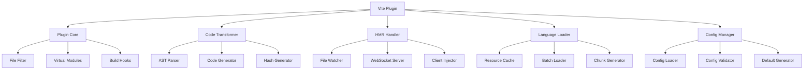

# TransLink I18n Vite 插件开发教程

> 本教程详细记录了如何开发一个功能完整的 Vite 插件，实现代码转换、热更新、懒加载等高级功能。

## 📋 目标概述

在完成运行时库开发后，我们将实现 Vite 插件的核心功能：

- 🔄 **智能代码转换**: 自动将 `$tsl('中文')` 转换为 `t('hash')`
- ⚡ **热更新支持**: 语言文件变更时实时更新界面
- 📦 **懒加载机制**: 按需加载语言包，优化首屏性能
- 🛠️ **构建优化**: 生产环境的代码分割和压缩
- 🎯 **开发体验**: 调试模式、错误提示、性能监控

## 🎯 最终实现效果

完成本教程后，你将拥有一个功能完整的 Vite 插件：

### 基础使用方式
```typescript
// vite.config.ts
import { defineConfig } from 'vite';
import { createI18nPlugin } from '@translink/vite-plugin-i18n';

export default defineConfig({
  plugins: [
    createI18nPlugin({
      transformTsl: true,
      hmr: true,
      lazyLoading: true,
      debug: true
    })
  ]
});
```

### 代码转换效果
```typescript
// 开发时编写
const message = $tsl('欢迎使用 TransLink I18n');

// 插件自动转换为
const message = t('a1b2c3d4', undefined, { defaultValue: '欢迎使用 TransLink I18n' });
```

## 🏗️ 核心架构设计

### 插件架构图



### 模块设计

```
packages/vite-plugin/src/
├── core/                      # 核心模块
│   ├── plugin.ts             # 主插件入口
│   ├── transformer.ts        # 代码转换器
│   ├── hmr-handler.ts        # 热更新处理
│   ├── language-loader.ts    # 语言加载器
│   └── config-manager.ts     # 配置管理器
├── utils/                    # 工具函数
│   └── logger.ts            # 日志工具
├── types/                    # 类型定义
│   └── index.ts
├── examples/                 # 使用示例
│   ├── vite.config.ts
│   └── vue-app.vue
└── index.ts                  # 主入口
```

## 🚀 实施步骤

### 第一步：插件核心架构

创建 `packages/vite-plugin/src/core/plugin.ts`：

```typescript
export function createI18nPlugin(options: I18nPluginOptions = {}): Plugin {
  let config: ResolvedConfig;
  let server: ViteDevServer | undefined;
  let transformer: I18nTransformer;
  let languageLoader: LanguageLoader;
  let hmrHandler: HMRHandler;

  return {
    name: 'translink-i18n',
    
    configResolved(resolvedConfig) {
      config = resolvedConfig;
      
      // 初始化核心组件
      transformer = new I18nTransformer(options, config);
      languageLoader = new LanguageLoader(options, config);
    },

    configureServer(devServer) {
      server = devServer;
      
      // 设置 HMR
      if (options.hmr) {
        hmrHandler = new HMRHandler(options, config, devServer, languageLoader);
        hmrHandler.setup();
      }
    },

    async transform(code, id) {
      // 代码转换逻辑
      const result = await transformer.transform(code, { filename: id });
      return result.hasChanged ? { code: result.code, map: result.map } : null;
    }
  };
}
```

**架构设计要点：**
- 🎯 **模块化设计**: 每个功能独立成模块，便于维护
- 🔧 **生命周期钩子**: 充分利用 Vite 的插件 API
- 📡 **事件驱动**: 通过事件系统解耦各模块
- ⚡ **性能优化**: 缓存机制和并发处理

### 第二步：智能代码转换系统

创建 `packages/vite-plugin/src/core/transformer.ts`：

```typescript
export class I18nTransformer {
  /**
   * 转换 $tsl 调用为 t(hash) 形式
   */
  private transformTslCalls(ast: any, s: MagicString, isDev: boolean) {
    let transformed = 0;
    const extractedKeys: string[] = [];

    // 使用 gogocode 查找 $tsl 调用
    ast.find('$_$($$$)').each((path: any) => {
      const node = path.node;
      
      if (node.callee?.name === '$tsl') {
        const firstArg = node.arguments?.[0];
        
        if (firstArg?.type === 'Literal' && typeof firstArg.value === 'string') {
          const text = firstArg.value;
          const hash = this.generateHash(text);
          
          // 记录映射关系
          this.keyMappings.set(hash, text);
          extractedKeys.push(hash);
          
          // 替换代码
          if (isDev) {
            // 开发模式保留原文本
            s.overwrite(node.start, node.end, 
              `t('${hash}', undefined, { defaultValue: '${text}' })`);
          } else {
            // 生产模式只使用 hash
            s.overwrite(node.start, node.end, `t('${hash}')`);
          }
          
          transformed++;
        }
      }
    });

    return { hasChanged: transformed > 0, transformed, extractedKeys };
  }

  /**
   * 生成稳定的哈希值
   */
  private generateHash(text: string): string {
    return createHash('md5')
      .update(text)
      .digest('hex')
      .substring(0, 8);
  }
}
```

**转换系统特性：**
- 🎯 **AST 精确解析**: 使用 gogocode 进行准确的代码分析
- 🔄 **智能转换**: 开发/生产环境不同的转换策略
- 🛡️ **安全处理**: 防止重复转换和错误处理
- 📊 **统计分析**: 提供详细的转换统计信息

### 第三步：热更新系统

创建 `packages/vite-plugin/src/core/hmr-handler.ts`：

```typescript
export class HMRHandler {
  /**
   * 设置文件监听
   */
  private setupLanguageFileWatcher(): void {
    const localesPath = path.resolve(this.config.root, 'locales');
    
    this.watcher = chokidar.watch(`${localesPath}/**/*.json`, {
      ignored: /node_modules/,
      persistent: true
    });

    this.watcher
      .on('change', (filePath) => this.handleLanguageFileChange(filePath))
      .on('add', (filePath) => this.handleLanguageFileChange(filePath))
      .on('unlink', (filePath) => this.handleLanguageFileChange(filePath));
  }

  /**
   * 处理语言文件变更
   */
  private async handleLanguageFileChange(filePath: string): Promise<void> {
    const { language, namespace } = this.parseLanguageFilePath(filePath);
    
    // 重新加载资源
    const resource = await this.languageLoader.loadLanguageResource(language, namespace);
    
    // 发送 HMR 更新
    this.server.ws.send({
      type: 'custom',
      event: 'i18n:language-updated',
      data: {
        language,
        namespace,
        resource: resource.content,
        timestamp: Date.now()
      }
    });
  }

  /**
   * 注入客户端代码
   */
  private injectHMRClient(): void {
    const clientCode = `
    if (import.meta.hot) {
      import.meta.hot.on('i18n:language-updated', (data) => {
        // 通知运行时库更新
        if (window.__TRANSLINK_I18N__) {
          window.__TRANSLINK_I18N__.handleHMRUpdate(data);
        }
      });
    }`;
    
    // 注入到客户端
    this.server.ws.send({
      type: 'custom',
      event: 'i18n:client-inject',
      data: { code: clientCode }
    });
  }
}
```

**热更新特性：**
- 📁 **文件监听**: 实时监控语言文件变化
- ⚡ **即时更新**: 无需刷新页面即可看到翻译更新
- 🔄 **智能缓存**: 自动清理过期缓存
- 📡 **WebSocket 通信**: 高效的客户端-服务端通信

### 第四步：懒加载机制

创建 `packages/vite-plugin/src/core/language-loader.ts`：

```typescript
export class LanguageLoader {
  /**
   * 批量加载语言资源
   */
  async loadMultipleLanguages(
    languages: string[], 
    namespaces: string[] = ['translation']
  ): Promise<Map<string, LanguageResource>> {
    const results = new Map<string, LanguageResource>();
    const loadPromises: Promise<void>[] = [];

    for (const language of languages) {
      for (const namespace of namespaces) {
        const promise = this.loadLanguageResource(language, namespace)
          .then(resource => results.set(`${language}:${namespace}`, resource))
          .catch(error => logger.warn(`Failed to load ${language}:${namespace}:`, error));
        
        loadPromises.push(promise);
      }
    }

    await Promise.all(loadPromises);
    return results;
  }

  /**
   * 生成语言模块（虚拟模块）
   */
  generateLanguageModule(language: string): string {
    const resources = Array.from(this.resourceCache.values())
      .filter(r => r.language === language);

    const moduleContent = resources.reduce((acc, resource) => {
      acc[resource.namespace] = resource.content;
      return acc;
    }, {} as Record<string, any>);

    return `export default ${JSON.stringify(moduleContent, null, 2)};`;
  }

  /**
   * 生成构建时的语言块
   */
  generateLanguageChunks(): Map<string, any> {
    const chunks = new Map<string, any>();
    
    for (const resource of this.resourceCache.values()) {
      const chunkName = resource.namespace === 'translation' 
        ? resource.language 
        : `${resource.language}.${resource.namespace}`;
      
      chunks.set(chunkName, resource.content);
    }

    return chunks;
  }
}
```

**懒加载特性：**
- 📦 **按需加载**: 只加载当前需要的语言包
- 🚀 **并发加载**: 同时加载多个语言资源
- 💾 **智能缓存**: 避免重复加载相同资源
- 🔄 **虚拟模块**: 通过 Vite 虚拟模块系统提供资源

### 第五步：配置管理系统

创建 `packages/vite-plugin/src/core/config-manager.ts`：

```typescript
export class ConfigManager {
  /**
   * 加载用户配置
   */
  async loadUserConfig(): Promise<any> {
    try {
      // 动态导入配置文件
      const configModule = await import(this.configPath + '?t=' + Date.now());
      this.userConfig = configModule.default || configModule;
      
      return this.userConfig;
    } catch (error) {
      // 返回默认配置
      this.userConfig = this.getDefaultConfig();
      return this.userConfig;
    }
  }

  /**
   * 生成配置模块代码
   */
  generateConfigModule(): string {
    const mergedConfig = this.getMergedConfig();
    
    return `
    export const i18nConfig = ${JSON.stringify(mergedConfig, null, 2)};
    
    export function getLanguagePath(language, namespace = 'translation') {
      const loadPath = i18nConfig.loadPath || './locales/{{lng}}.json';
      return loadPath
        .replace('{{lng}}', language)
        .replace('{{ns}}', namespace);
    }
    
    // HMR support
    if (import.meta.hot) {
      import.meta.hot.accept();
    }
    `;
  }

  /**
   * 验证配置
   */
  validateConfig(config: any): { valid: boolean; errors: string[] } {
    const errors: string[] = [];
    
    if (!config.defaultLanguage) {
      errors.push('defaultLanguage is required');
    }
    
    if (!config.supportedLanguages || !Array.isArray(config.supportedLanguages)) {
      errors.push('supportedLanguages must be an array');
    }
    
    return { valid: errors.length === 0, errors };
  }
}
```

**配置管理特性：**
- 📄 **灵活配置**: 支持 TypeScript 配置文件
- ✅ **配置验证**: 自动验证配置的正确性
- 🔄 **热重载**: 配置文件变更时自动重新加载
- 🛠️ **默认值**: 提供合理的默认配置

### 第六步：构建优化

在插件中添加构建优化：

```typescript
// 在 plugin.ts 中添加
export function createI18nPlugin(options: I18nPluginOptions = {}): Plugin {
  return {
    // ... 其他钩子

    generateBundle(options, bundle) {
      // 生成语言资源文件
      if (config.command === 'build' && resolvedOptions.lazyLoading) {
        const languageChunks = languageLoader.generateLanguageChunks();
        
        for (const [chunkName, chunkContent] of languageChunks) {
          this.emitFile({
            type: 'asset',
            fileName: `locales/${chunkName}.json`,
            source: JSON.stringify(chunkContent, null, 2)
          });
        }
      }
    },

    // 虚拟模块支持
    resolveId(id) {
      if (id.startsWith('virtual:i18n-')) {
        return id;
      }
      return null;
    },

    load(id) {
      if (id.startsWith('virtual:i18n-language-')) {
        const language = id.replace('virtual:i18n-language-', '');
        return languageLoader.generateLanguageModule(language);
      }

      if (id === 'virtual:i18n-config') {
        return configManager.generateConfigModule();
      }

      return null;
    }
  };
}
```

## 🧪 使用示例

### Vite 配置示例

```typescript
// vite.config.ts
import { defineConfig } from 'vite';
import vue from '@vitejs/plugin-vue';
import { createI18nPlugin } from '@translink/vite-plugin-i18n';

export default defineConfig({
  plugins: [
    vue(),
    createI18nPlugin({
      // 基础配置
      configFile: 'i18n.config.ts',
      defaultLanguage: 'zh-CN',
      supportedLanguages: ['zh-CN', 'en-US', 'ja-JP'],
      
      // 文件处理
      include: ['src/**/*.{vue,ts,js}'],
      exclude: ['node_modules/**'],
      
      // 功能开关
      transformTsl: true,
      hmr: true,
      lazyLoading: true,
      debug: true,
      
      // 预加载配置
      preload: {
        languages: ['zh-CN'],
        timing: 'immediate'
      }
    })
  ]
});
```

### Vue 组件示例

```vue
<template>
  <div>
    <!-- 插件会自动转换这些 $tsl 调用 -->
    <h1>{{ $tsl('欢迎使用 TransLink I18n') }}</h1>
    <p>{{ $tsl('这是一个功能强大的国际化解决方案') }}</p>
    
    <button @click="showMessage">
      {{ $tsl('点击我') }}
    </button>
  </div>
</template>

<script setup>
const showMessage = () => {
  // 这里的中文也会被自动转换
  alert($tsl('按钮被点击了！'));
};
</script>
```

### 转换效果

```typescript
// 开发时代码
const message = $tsl('欢迎使用 TransLink I18n');

// 插件转换后（开发模式）
const message = t('a1b2c3d4', undefined, { 
  defaultValue: '欢迎使用 TransLink I18n' 
});

// 插件转换后（生产模式）
const message = t('a1b2c3d4');
```

## 🎯 高级功能

### 1. 自定义转换规则

```typescript
createI18nPlugin({
  transformRules: [
    {
      // 转换 console.log 中的中文
      pattern: /console\.log\(['"`]([^'"`]*[\u4e00-\u9fff][^'"`]*)['"`]\)/g,
      transform: (match, text) => {
        const hash = generateHash(text);
        return `console.log(t('${hash}'))`;
      }
    }
  ]
})
```

### 2. 预加载策略

```typescript
createI18nPlugin({
  preload: {
    languages: ['zh-CN', 'en-US'],  // 预加载的语言
    timing: 'idle',                 // 空闲时加载
    namespaces: ['common', 'nav']   // 预加载的命名空间
  }
})
```

### 3. 构建优化

```typescript
// vite.config.ts
export default defineConfig({
  build: {
    rollupOptions: {
      output: {
        // 语言文件单独打包
        manualChunks: {
          'i18n-zh-CN': ['virtual:i18n-language-zh-CN'],
          'i18n-en-US': ['virtual:i18n-language-en-US']
        }
      }
    }
  }
});
```

## ✅ 验证检查清单

- [ ] ✅ 插件核心架构正常工作
- [ ] ✅ 代码转换功能准确无误
- [ ] ✅ 热更新实时生效
- [ ] ✅ 懒加载机制有效
- [ ] ✅ 配置管理完整
- [ ] ✅ 构建优化生效
- [ ] ✅ 示例项目运行正常

## 🎉 完成效果

完成本教程后，你将拥有一个生产级别的 Vite 插件：

1. **智能代码转换**: 自动处理 `$tsl` 到 `t(hash)` 的转换
2. **热更新支持**: 语言文件变更时实时更新界面
3. **懒加载机制**: 按需加载语言包，优化性能
4. **构建优化**: 代码分割、压缩、缓存优化
5. **开发体验**: 调试模式、错误提示、性能监控
6. **配置灵活**: 支持多种配置方式和自定义规则

这个 Vite 插件不仅提供了强大的功能，还确保了出色的开发体验和构建性能。

---

*本教程展示了如何构建一个功能完整的 Vite 插件，涵盖了从代码转换到构建优化的各个方面。*
